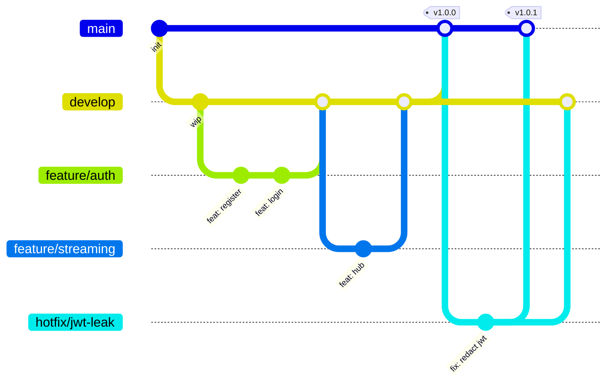

# Stratégie Git — StreamPulse

| | |
|---|---|
| **Version** | 1.0.0 |
| **Couverture RNCP** | A3.1 — Ce3.1.1 |
| **Statut** | Adopté |

> Ce document décrit la stratégie de gestion du dépôt, des branches, des commits, du suivi de l'historique et des protections appliquées.

---

## 1. Choix : GitFlow simplifié (trunk-friendly)

### Modèle retenu



### Branches permanentes

| Branche | Rôle | Auto-déploiement |
|---|---|---|
| `main` | Code en **production**. Toujours stable. | Production (auto) |
| `develop` | Intégration des fonctionnalités. | Staging (auto) |

### Branches temporaires

| Préfixe | Source | Cible | Usage |
|---|---|---|---|
| `feature/<slug>` | `develop` | `develop` | Nouvelle fonctionnalité |
| `fix/<slug>` | `develop` | `develop` | Bug non urgent |
| `hotfix/<slug>` | `main` | `main` + `develop` | Correctif urgent en prod |
| `release/<x.y.z>` | `develop` | `main` + `develop` | Préparation d'une release |
| `chore/<slug>` | `develop` | `develop` | Maintenance, deps |
| `docs/<slug>` | `develop` | `develop` | Documentation seule |

### Pourquoi pas trunk-based pur ?

Le projet est étudiant et impliqué dans un Bloc 3 qui exige un historique propre, des **commits signés** et une **revue obligatoire**. GitFlow simplifié offre une séparation `develop`/`main` qui :

- isole la staging de la production ;
- permet des PR de feature multi-commits cohérentes ;
- conserve une linéarité grâce aux *squash merges*.

---

## 2. Convention de commit

### Format Conventional Commits

```
<type>(<scope>): <description impérative au présent>

<corps optionnel — pourquoi, contexte>

<footer optionnel — Refs, BREAKING CHANGE, Co-Authored-By>
```

### Types acceptés

| Type | Effet sur la version |
|---|---|
| `feat` | Bump MINOR |
| `fix` | Bump PATCH |
| `perf` | Bump PATCH |
| `refactor` | Aucun |
| `docs` | Aucun |
| `test` | Aucun |
| `build` | Aucun |
| `ci` | Aucun |
| `chore` | Aucun |
| `style` | Aucun |

### Breaking changes

Ajouter `!` après le type ou un footer `BREAKING CHANGE: ...` → bump MAJOR.

```
feat(api)!: remove deprecated /v0 endpoints

BREAKING CHANGE: all clients must migrate to /api/v1 before upgrade.
```

### Scopes recommandés

`auth`, `streaming`, `playlists`, `admin`, `db`, `ci`, `docker`, `flutter`, `bloc`, `docs`, `deps`, `obs`.

---

## 3. Signature des commits

**Tous les commits doivent être signés GPG**. Exigence RNCP (Ce3.1.1).

### Génération de la clé

```bash
gpg --full-generate-key             # RSA 4096, sans expiration ou 2 ans
gpg --list-secret-keys --keyid-format=long
gpg --armor --export <KEY_ID>       # Copier dans GitHub > Settings > GPG keys
```

### Configuration locale

```bash
git config --global user.signingkey <KEY_ID>
git config --global commit.gpgsign true
git config --global tag.gpgSign true
```

### Vérification CI

Un job GitHub Actions rejette les commits non signés sur `main` et `develop`.

---

## 4. Protection des branches

### `main` (production)

- ❌ Push direct interdit.
- ✅ Pull Request obligatoire.
- ✅ **2 reviews approuvées** minimum.
- ✅ Tous les jobs CI doivent passer (lint, tests, coverage ≥ 80 %, sécurité).
- ✅ Commits signés requis.
- ✅ Historique linéaire (merge en *squash and merge* ou *rebase and merge*).
- ❌ Force push interdit.
- ✅ Conversations résolues avant merge.

### `develop` (staging)

- ❌ Push direct interdit.
- ✅ Pull Request obligatoire.
- ✅ **1 review approuvée** minimum.
- ✅ CI verte requise.
- ✅ Commits signés requis.
- ❌ Force push interdit.

### Branches temporaires

- ✅ Rebase / amend autorisés tant que pas mergées.
- ⚠️ Force push autorisé sur sa propre branche feature, **interdit** sur branches partagées.

---

## 5. Workflow type

### Démarrer une feature

```bash
git checkout develop
git pull
git checkout -b feature/streaming-hub
# … coder …
git add backend/internal/infrastructure/streaming/
git commit -S -m "feat(streaming): implement pub/sub hub with backpressure"
git push -u origin feature/streaming-hub
gh pr create --base develop --title "feat(streaming): pub/sub hub"
```

### Mettre à jour sa branche

```bash
git fetch origin
git rebase origin/develop          # Préférer rebase pour un historique lisible
# Résoudre les conflits, puis :
git push --force-with-lease        # Jamais --force aveugle
```

### Préparer une release

```bash
git checkout develop && git pull
git checkout -b release/1.1.0
# Bumper la version dans CHANGELOG.md, pubspec.yaml, etc.
git commit -S -m "chore(release): prepare 1.1.0"
git push -u origin release/1.1.0
gh pr create --base main --title "release: 1.1.0"
# Après merge :
git checkout main && git pull
git tag -s v1.1.0 -m "Release 1.1.0"
git push origin v1.1.0
# Backmerge dans develop :
git checkout develop && git merge main && git push
```

### Hotfix

```bash
git checkout main && git pull
git checkout -b hotfix/jwt-leak
# … corriger …
git commit -S -m "fix(auth): redact JWT from log output"
git push -u origin hotfix/jwt-leak
gh pr create --base main --title "fix(auth): jwt log redaction"
# Après merge sur main → backmerge sur develop.
```

---

## 6. Suivi de l'historique (Ce3.1.1)

- **Pas de force push** sur `main` / `develop`.
- **Pas de rewrite** de l'historique après merge.
- **Tags signés** pour chaque release (`v<x.y.z>`).
- **GitHub Releases** générées avec note tirée du `CHANGELOG.md`.
- Outils de suivi :
  - `git log --graph --oneline --all`
  - `git shortlog -sne` (contributions par membre)
  - GitHub Insights → Contributors

---

## 7. Template de Pull Request

Stocké dans `.github/pull_request_template.md` :

```markdown
## Contexte
<!-- Pourquoi ce changement ? Lien vers issue / ticket RNCP -->

## Changements
- ...

## Comment tester
- [ ] ...

## Checklist
- [ ] Tests passent (`go test ./... -race -cover` / `flutter test`)
- [ ] Couverture ≥ 80%
- [ ] Documentation mise à jour
- [ ] CHANGELOG.md mis à jour
- [ ] Commits signés
- [ ] Pas de secrets dans le diff
- [ ] Tickets RNCP référencés
```

---

## 8. Sécurité du dépôt

- **`.gitignore`** strict : `.env`, `*.pem`, `*.key`, `uploads/`, `coverage.out`.
- **gitleaks** dans la CI pour détecter tout secret avant merge.
- **Dependabot** activé sur le dépôt pour les dépendances Go, Dart, GitHub Actions, Docker.
- **GitHub Security alerts** activées.
- Audit hebdomadaire des secrets exposés.

---

## 9. Métriques de qualité du dépôt

| Indicateur | Cible | Mesure |
|---|---|---|
| % commits signés | 100 % | `git log --pretty="%G?" \| sort \| uniq -c` |
| % PRs avec review | 100 % | GitHub Insights |
| Temps moyen review | < 24 h | GitHub Insights |
| Couverture CI | ≥ 80 % | Codecov / artefact CI |
| PRs ouvertes > 7 jours | 0 | Audit hebdomadaire |

---

## 10. Annexes

- [Conventional Commits 1.0.0](https://www.conventionalcommits.org/fr/v1.0.0/)
- [Semantic Versioning 2.0.0](https://semver.org/lang/fr/)
- [Keep a Changelog 1.1.0](https://keepachangelog.com/fr/1.1.0/)
- [GitHub Branch Protection](https://docs.github.com/en/repositories/configuring-branches-and-merges-in-your-repository/managing-protected-branches)
