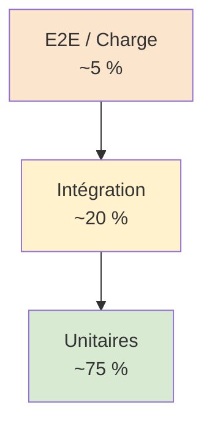

# Plan de tests itératif & Cahier de recette — StreamPulse

| | |
|---|---|
| **Version** | 1.0.0 |
| **Couverture RNCP** | A3.2 — Ce3.2.1, Ce3.2.2, Ce3.2.3, Ce3.2.4 |
| **Statut** | Adopté |

> Ce document décrit l'organisation, les outils et les scénarios de test du projet StreamPulse. Il intègre le **cahier de recette** (tous les cas d'utilisation à valider) et démontre que la planification des tests est **itérative**, menée **en parallèle** du développement et non en fin de projet.

---

## Sommaire

1. [Stratégie de test](#1-stratégie-de-test)
2. [Niveaux et types de tests](#2-niveaux-et-types-de-tests)
3. [Outils retenus](#3-outils-retenus)
4. [Planification itérative](#4-planification-itérative-ce322)
5. [Cahier de recette (cas d'utilisation)](#5-cahier-de-recette-ce321-ce324)
6. [Tests non-fonctionnels](#6-tests-non-fonctionnels)
7. [Tests de sécurité](#7-tests-de-sécurité)
8. [Suivi des bogues et régressions](#8-suivi-des-bogues-et-régressions)
9. [Couverture et critères de sortie](#9-couverture-et-critères-de-sortie)
10. [Annexes](#10-annexes)

---

## 1. Stratégie de test

### Principes

- **Shift-left** : les tests sont écrits au moment du développement de la feature, pas après.
- **Pyramide de tests** : beaucoup d'unitaires rapides, moins d'intégration, peu d'E2E.
- **Automatisation** : 100 % des tests sont automatisés et lancés dans la CI.
- **Traçabilité** : chaque test référence une *user story* (US-XXX) du cahier des charges.
- **Race detector** : toujours activé côté Go (`go test -race`).
- **Coverage ≥ 80 %** sur le backend (mesure CI).

### Pyramide cible



---

## 2. Niveaux et types de tests

| Niveau | Périmètre | Outils | Quand |
|---|---|---|---|
| **Unitaire backend** | Fonction / méthode isolée, dépendances mockées | `testing`, `testify`, `mockgen` | À chaque commit |
| **Unitaire frontend** | Bloc, repository, fonction pure | `flutter_test`, `bloc_test`, `mocktail` | À chaque commit |
| **Widget tests** | Widgets Flutter isolés | `flutter_test` (`testWidgets`) | À chaque commit |
| **Intégration backend** | UseCase + DB réelle | `testcontainers-go` ou Docker | À chaque PR |
| **Intégration frontend** | App complète en navigation | `integration_test` Flutter | Avant release |
| **E2E** | Parcours utilisateur complet | `integration_test` + API live | Avant release |
| **Charge** | Endurance et capacité | `k6`, `vegeta`, `go test -bench` | Avant release majeure |
| **Sécurité** | Vulnérabilités | `govulncheck`, `trivy`, `gitleaks`, `gosec` | Quotidien (cron) + PR |
| **Accessibilité** | a11y mobile et docs | TalkBack/VoiceOver, Lighthouse, axe | Avant release |

---

## 3. Outils retenus

| Outil | Rôle |
|---|---|
| `go test -race -cover` | Tests Go avec détection de races et couverture |
| `testify` | Assertions et mocks Go |
| `mockgen` (uber-go/mock) | Génération de mocks pour interfaces |
| `httptest` | Tests handlers HTTP |
| `testcontainers-go` | Base PostgreSQL réelle pour intégration |
| `flutter_test` | Tests unitaires Flutter |
| `bloc_test` | Tests des BLoCs |
| `mocktail` | Mocks Dart |
| `integration_test` | Tests d'intégration Flutter |
| `k6` | Tests de charge HTTP |
| `golangci-lint` | Lint Go (couvre staticcheck, errcheck, etc.) |
| `govulncheck` | Détection de vulnérabilités Go |
| `trivy` | Scan d'images Docker |
| `gitleaks` | Détection de secrets dans le repo |
| `gosec` | Analyse sécurité Go statique |
| Lighthouse | Audit accessibilité doc HTML |

---

## 4. Planification itérative (Ce3.2.2)

Les tests ne sont pas une phase finale : ils accompagnent **chaque sprint**.

### Cycle de chaque ticket


### Calendrier de tests par sprint

| Sprint | Focus features | Tests ajoutés en parallèle |
|---|---|---|
| **S1** | Setup, auth (register/login) | Unitaires auth, intégration DB, sécurité bcrypt/JWT |
| **S2** | Streaming hub, broadcaster | Unitaires hub avec `-race`, bench mémoire |
| **S3** | Playlists, tracks, uploads | Unitaires CRUD, intégration multipart |
| **S4** | Observabilité, dashboards | Tests metrics endpoint, vérif trace propagation |
| **S5** | Frontend complet, lecteur | Tests BLoC, widget, integration_test |
| **S6** | Hardening, sécurité, RGPD | Tests OWASP, RGPD, charge k6 |
| **Pré-release** | Stabilisation | E2E complets, accessibilité, recette client |

### Lien CI

Chaque push exécute :

1. Lint (`go vet`, `golangci-lint`, `flutter analyze`).
2. Unitaires + race + coverage.
3. Build.
4. Scan sécurité.
5. (sur PR vers `develop`) intégration DB réelle.

---

## 5. Cahier de recette (Ce3.2.1, Ce3.2.4)

> Chaque ligne référence une **user story** du cahier des charges. La colonne *Attente documentée* renvoie aux critères d'acceptation des US (Ce3.2.4).

### 5.1 Authentification

| ID test | US | Cas | Données | Résultat attendu (attente documentée) | Type |
|---|---|---|---|---|---|
| T-AUTH-01 | US-001 | Inscription nominale | email, username, password valides | 201, user créé, JWT retourné | E2E |
| T-AUTH-02 | US-001 | Email déjà pris | email existant | 409 Conflict | Intégration |
| T-AUTH-03 | US-001 | Mot de passe < 8 caractères | password = "1234" | 400 Bad Request | Unitaire |
| T-AUTH-04 | US-001 | Email malformé | email = "not-an-email" | 400 Bad Request | Unitaire |
| T-AUTH-05 | US-002 | Login nominal | credentials valides | 200, JWT retourné | E2E |
| T-AUTH-06 | US-002 | Mauvais mot de passe | password incorrect | 401 Unauthorized | Intégration |
| T-AUTH-07 | US-002 | Token JWT contient role | login utilisateur broadcaster | payload contient `role=broadcaster` | Unitaire |
| T-AUTH-08 | US-002 | Token expiré rejeté | JWT avec `exp` passé | 401 + log d'audit | Unitaire |
| T-AUTH-09 | US-002 | Brute-force bloqué | 11 tentatives en 1 min | 429 Too Many Requests | Intégration |
| T-AUTH-10 | US-003 | Lire son profil | GET /users/me avec JWT | 200, mot de passe non retourné | Intégration |
| T-AUTH-11 | US-004 | Suppression RGPD | DELETE /users/me | 204 + données purgées (cascade) | E2E |
| T-AUTH-12 | US-005 | Export RGPD | GET /users/me/data | 200, JSON contient user + playlists + streams | E2E |

### 5.2 Streaming

| ID test | US | Cas | Données | Résultat attendu | Type |
|---|---|---|---|---|---|
| T-STR-01 | US-030 | Créer un stream (broadcaster) | role=broadcaster | 201 + stream `offline` | Intégration |
| T-STR-02 | US-030 | Créer un stream (user) | role=user | 403 Forbidden | Intégration |
| T-STR-03 | US-031 | Publier un flux | broadcaster + audio chunks | 200, status=`live`, hub multiplexe | E2E |
| T-STR-04 | US-031 | 100 listeners simultanés | 1 broadcaster + 100 clients | Tous reçoivent les chunks, no leak | Charge |
| T-STR-05 | US-011 | Écouter un stream | listener anonyme | 200, headers chunked, audio reçu | E2E |
| T-STR-06 | US-011 | Listener se déconnecte | abandon HTTP | goroutine cleanup, métriques OK | Intégration |
| T-STR-07 | US-032 | Arrêt diffusion | DELETE | status=`offline`, listeners libérés | E2E |
| T-STR-08 | US-033 | Compteur listeners | 5 connexions / 2 déconnexions | métrique `active_listeners=3` | Unitaire |
| T-STR-09 | US-010 | Liste streams live | GET /streams | 200, ordonné par status puis date | Intégration |
| T-STR-10 | US-031 | Pas de memory leak | 1 000 connexions/déconnexions | mémoire stable ± 5 % | Charge |
| T-STR-11 | US-031 | Race detector | tous tests | aucune data race détectée | Unitaire |

### 5.3 Playlists & tracks

| ID test | US | Cas | Données | Résultat attendu | Type |
|---|---|---|---|---|---|
| T-PLA-01 | US-020 | Créer playlist | name, description | 201 | Intégration |
| T-PLA-02 | US-021 | Ajouter track | playlist + trackId | 200, track présent dans la liste | Intégration |
| T-PLA-03 | US-022 | Réordonner tracks | nouvelle position | ordre persisté en base | Intégration |
| T-PLA-04 | US-023 | Lecture séquentielle | playlist multi-tracks | tracks lus dans l'ordre | E2E mobile |
| T-PLA-05 | — | Owner only | user A modifie playlist user B | 403 | Intégration |
| T-PLA-06 | US-034 | Upload track valide | mp3 valide | 201, track créé, durée extraite | Intégration |
| T-PLA-07 | US-034 | Upload format invalide | fichier .exe | 415 Unsupported Media Type | Unitaire |

### 5.4 Administration

| ID test | US | Cas | Données | Résultat attendu | Type |
|---|---|---|---|---|---|
| T-ADM-01 | US-040 | Liste users (admin) | GET /admin/users | 200 + pagination | Intégration |
| T-ADM-02 | US-040 | Liste users (user) | role=user | 403 | Intégration |
| T-ADM-03 | US-041 | Modifier role | PUT role | 200, effet immédiat | Intégration |
| T-ADM-04 | US-042 | Désactiver compte | DELETE | 204, login refusé | E2E |
| T-ADM-05 | US-043 | Dashboard | métriques globales | données cohérentes | Manuel |

### 5.5 Mobile

| ID test | US | Cas | Outil | Résultat attendu |
|---|---|---|---|---|
| T-MOB-01 | US-002 | Login UI | `bloc_test` | AuthBloc émet `[Loading, Authenticated]` |
| T-MOB-02 | US-002 | Login erreur | `bloc_test` | émet `[Loading, Error]` |
| T-MOB-03 | US-013 | Lecture en arrière-plan | manuel device | audio continue après lock |
| T-MOB-04 | US-013 | Interruption appel | manuel | pause auto, reprise après |
| T-MOB-05 | US-051 | TalkBack / VoiceOver | manuel | navigation complète possible |
| T-MOB-06 | — | 60 FPS pendant streaming | Flutter DevTools | aucune jank > 16 ms soutenu |
| T-MOB-07 | US-011 | Reconnexion réseau | airplane on/off | reprise auto du flux |

### 5.6 Transverse

| ID test | US | Cas | Résultat attendu |
|---|---|---|---|
| T-CFG-01 | — | Démarrage sans `.env` | échec explicite si `DATABASE_URL` ou `JWT_SECRET` manquants |
| T-CFG-02 | — | Démarrage env vars seules | OK sans fichier `.env` |
| T-OBS-01 | — | `/metrics` retourne format Prometheus | présence de `http_requests_total`, `active_streams`, `active_listeners` |
| T-OBS-02 | — | Trace mobile → API → DB visible Grafana | trace contient ≥ 3 spans corrélés |
| T-OBS-03 | — | Logs JSON contiennent `trace_id` | corrélation logs/traces |
| T-RGPD-01 | US-004 | Cascade suppression | streams, playlists, tracks de l'utilisateur supprimés |
| T-RGPD-02 | — | Logs anonymisés | aucun email en clair dans les logs |
| T-SEC-01 | — | Headers sécurité | `X-Content-Type-Options`, `X-Frame-Options` présents |
| T-SEC-02 | — | CORS strict en prod | refus d'une origine non whitelistée |

---

## 6. Tests non-fonctionnels

### 6.1 Performance / charge

| Scénario | Outil | Critère |
|---|---|---|
| 100 listeners simultanés / 1 stream | k6 | aucun chunk perdu, p95 < 500 ms |
| 1 000 requêtes auth/min | k6 | p95 < 200 ms, 0 erreur |
| Endurance 1h (50 listeners) | k6 | mémoire stable, pas de fuite |

Exemple de script `scripts/load-test.js` :

```javascript
import http from 'k6/http';
import { check } from 'k6';

export const options = {
  scenarios: {
    listeners: {
      executor: 'ramping-vus',
      stages: [
        { duration: '1m', target: 100 },
        { duration: '5m', target: 100 },
        { duration: '1m', target: 0 },
      ],
    },
  },
};

export default function () {
  const res = http.get('http://localhost:8080/api/v1/streams');
  check(res, { 'status 200': r => r.status === 200 });
}
```

### 6.2 Estimation des coûts (Ce3.5.4)

Mesurer la consommation CPU / mémoire / bande passante pour N flux simultanés et extrapoler :

| Flux simultanés | CPU moyen | RAM | Bande passante | Coût VPS estimé |
|---|---|---|---|---|
| 10 | *à mesurer* | *à mesurer* | *à mesurer* | *à mesurer* |
| 50 | *à mesurer* | *à mesurer* | *à mesurer* | *à mesurer* |
| 100 | *à mesurer* | *à mesurer* | *à mesurer* | *à mesurer* |

Les résultats finaux sont consignés dans `docs/adr/0008-streaming-pubsub.md`.

---

## 7. Tests de sécurité

| Test | Outil | Fréquence |
|---|---|---|
| Vulnérabilités deps Go | `govulncheck` | Chaque PR + cron quotidien |
| Vulnérabilités deps Flutter | `flutter pub outdated --mode=null-safety` | Hebdomadaire |
| Vulnérabilités image Docker | `trivy image streampulse:latest` | Chaque build |
| Secrets dans le code | `gitleaks` | Chaque PR |
| Analyse statique Go | `gosec ./...` | Chaque PR |
| Injection SQL | tests d'intégration ciblés | Chaque release |
| XSS / CSRF | tests handlers | Chaque release |
| Brute-force auth | T-AUTH-09 | Chaque release |
| TLS configuration | SSL Labs | Chaque déploiement prod |

---

## 8. Suivi des bogues et régressions

- Chaque bug est ouvert comme **GitHub Issue** avec label `bug` et priorité (`P0`/`P1`/`P2`).
- Un bug confirmé reçoit **un test rouge** avant le fix (TDD bug-driven).
- Le test reste après fix → suite de **non-régression**.
- Un fichier `docs/REGRESSIONS.md` *(optionnel)* peut archiver les bugs notables et leurs leçons.

---

## 9. Couverture et critères de sortie

| Critère | Cible | Mesure |
|---|---|---|
| Couverture backend | ≥ 80 % | `go test -coverprofile` |
| Couverture frontend | ≥ 60 % (cible) | `flutter test --coverage` |
| Tests E2E principaux verts | 100 % | CI |
| Vulnérabilités critiques | 0 | `trivy`, `govulncheck` |
| Score Lighthouse doc | ≥ 80 | Lighthouse |
| Score SSL Labs (prod) | ≥ A | SSL Labs |

**Critère de release** : toutes les lignes du cahier de recette correspondant aux US livrées doivent être en statut ✅ avant tag.

---

## 10. Annexes

### 10.1 Génération des mocks Go

```bash
cd backend
mockgen -source=internal/domain/repository/user_repository.go \
        -destination=internal/domain/repository/mocks/user_repository.go \
        -package=mocks
```

### 10.2 Lancer les tests localement

```bash
# Backend
cd backend && go test ./... -race -cover

# Frontend
cd frontend && flutter test --coverage

# Charge
k6 run scripts/load-test.js
```

### 10.3 Mapping US → tests (extrait)

| US | Tests |
|---|---|
| US-001 | T-AUTH-01..04 |
| US-002 | T-AUTH-05..09, T-MOB-01..02 |
| US-011 | T-STR-05, T-MOB-07 |
| US-031 | T-STR-03, T-STR-04, T-STR-10, T-STR-11 |
| US-051 | T-MOB-05 |
