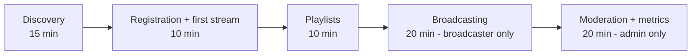

# User training plan — StreamPulse

| | |
|---|---|
| **Version** | 1.0.0 |
| **Language** | English (Version française: [`PLAN_FORMATION-fr.md`](./PLAN_FORMATION-fr.md)) |
| **RNCP coverage** | A3.6 — Ce3.6.5 |

> This training plan is designed so that every user — whatever their profile — can start using StreamPulse independently. It includes explicit adaptations for people with disabilities.

---

## Table of contents

1. [User profiles](#1-user-profiles)
2. [Progressive learning path](#2-progressive-learning-path)
3. [Listener guide](#3-listener-guide)
4. [Broadcaster guide](#4-broadcaster-guide)
5. [Administrator guide](#5-administrator-guide)
6. [Adaptations for people with disabilities](#6-adaptations-for-people-with-disabilities)
7. [FAQ](#7-faq)
8. [Additional resources](#8-additional-resources)

---

## 1. User profiles

| Profile | Required knowledge | Goal after training |
|---|---|---|
| **Listener (User)** | None (basic smartphone use) | Listen, save favorites, build playlists |
| **Broadcaster** | Listener level + basic audio knowledge | Start a live stream, manage audience, upload files |
| **Administrator (Admin)** | Broadcaster level + moderation awareness | Manage users, monitor metrics, moderate content |

---

## 2. Progressive learning path

**Total estimated training time:**
- Listener: ~ 35 minutes
- Broadcaster: ~ 55 minutes
- Administrator: ~ 75 minutes

---

## 3. Listener guide

### 3.1 Install the app

1. Open the **App Store** (iOS) or the **Play Store** (Android).
2. Search for *StreamPulse*.
3. Tap **Install**.
4. Open the app.

> 🔊 **Audio description**: *The StreamPulse icon is round, with a midnight-blue background and a white sound wave in its center.*

### 3.2 Create an account

| Step | Action | Why |
|---|---|---|
| 1 | Tap *Create an account* | Start registration |
| 2 | Enter a valid **email** | Used as login identifier |
| 3 | Choose a unique **username** | Public identity on the platform |
| 4 | Choose a **password** (≥ 8 characters) | Account security |
| 5 | Check *I accept the privacy policy* | GDPR compliance |
| 6 | Tap *Sign up* | Account creation + automatic login |

> ✅ You are redirected to the home screen with the list of streams.

### 3.3 Listen to a live stream

1. On the home screen, browse the list of **live streams**.
   - 🔴 An animated red dot indicates a live stream.
   - The listener count is shown on the right side of the title.
2. Tap a stream to start playback.
3. Use the controls:
   - **▶ / ⏸** — play / pause
   - **🔉 / 🔊** — volume (the device hardware buttons also work)
   - **⏹** — stop and return to the list

### 3.4 Background playback

- Leaving the app **does not stop** playback.
- Controls are available from the lockscreen and the notification center.

### 3.5 Create a playlist

1. Tab *Library* → button **+ New playlist**.
2. Enter a *name* and an optional *description*.
3. Tap *Create*.
4. From the track list: long-press → *Add to playlist* → choose one.

### 3.6 Manage your account

- *Settings → My profile*: update email or username.
- *Settings → Privacy → Export my data* (GDPR right of access).
- *Settings → Privacy → Delete my account* (GDPR right to erasure).

---

## 4. Broadcaster guide

### 4.1 Become a broadcaster

The *Broadcaster* role is granted by an administrator. Request it from *Settings → Become a broadcaster*.

### 4.2 Create a stream

1. Tab *Broadcast* → button **+ New stream**.
2. Enter a **title** and a **description** for the program.
3. Tap *Create stream* — the stream is created with the `offline` status.

### 4.3 Start broadcasting

1. Check the **microphone input level** (a VU meter is shown on screen).
2. Allow microphone access if requested.
3. Tap **🎙 Start broadcasting**.
4. The status switches to `🔴 live`.

### 4.4 Monitor your audience

While broadcasting:

- **Real-time listener count**.
- **Elapsed time** since the broadcast started.
- An indicative **network latency**.

### 4.5 Stop a broadcast

Tap **⏹ Stop** → confirm → status returns to `offline`. Listeners receive an end-of-stream notification.

### 4.6 Upload an audio file

1. Tab *Library → My tracks*.
2. Button **+ Upload**.
3. Select a file (`.mp3`, `.aac`, `.ogg` — 50 MB max).
4. Fill in *title*, *artist*, *automatically detected duration*.
5. Tap *Upload*.

### 4.7 Broadcasting best practices

- A **Wi-Fi 5 GHz** or stable 4G/5G connection (≥ 256 kbps upload).
- Place the microphone 10-15 cm from your mouth, in a quiet environment.
- Avoid switching networks during a broadcast.
- Briefly describe the content at the start so newcomers know what they're listening to.

---

## 5. Administrator guide

### 5.1 Open the admin area

The *Admin* tab is visible only with the `admin` role. If it is missing, sign out and sign back in.

### 5.2 Manage users

| Action | Path |
|---|---|
| List all users | *Admin → Users* |
| Filter by role | Selector at the top of the list |
| Change a role | Tap the user → *Change role* |
| Disable an account | Tap the user → *Disable* |

> ⚠️ Disabling is **reversible**. Final deletion must be requested by the user themselves (GDPR right to erasure).

### 5.3 Read the global dashboard

*Admin → Dashboard* shows:

- Active users (day / week / month)
- Active streams
- Concurrent listeners
- HTTP error rate
- API p95 latency

> Detailed technical dashboards are available in **Grafana**: `https://streampulse.<domain>:3000` (restricted to the technical team).

### 5.4 Content moderation

| Situation | Action |
|---|---|
| Report of an inappropriate stream | Stop the stream + disable the broadcaster account + send a warning email |
| Persistent abusive behavior | Permanent deactivation (with approval from a second admin) |
| GDPR violation (personal data leak) | Incident procedure — see `docs/RGPD.md` § 8 |

### 5.5 Read user feedback

*Admin → Feedback* lists feedback submitted from the app. It feeds the product roadmap (Ce3.3.2).

---

## 6. Adaptations for people with disabilities

### 6.1 Screen readers (TalkBack / VoiceOver)

- The entire app is navigable with a screen reader.
- Activation:
  - **iOS**: *Settings → Accessibility → VoiceOver → On*.
  - **Android**: *Settings → Accessibility → TalkBack → On*.
- All buttons, icons and meaningful images carry a **semantic label** (for example *"Play button"*).

### 6.2 Clear text instructions

Every step of this guide is written in **short sentences**, jargon-free, with an action verb at the start. Screenshots are always **paired with a textual description**.

### 6.3 Keyboard navigation (tablet + Bluetooth keyboard)

| Key | Action |
|---|---|
| `Tab` / `Shift+Tab` | Next / previous element |
| `Enter` | Activate |
| `Space` | Play / pause |
| `Esc` | Go back |
| `↑` / `↓` | Volume up / down |

### 6.4 Visual adjustments

- *Settings → Accessibility → Text size*: four sizes available.
- *Settings → Accessibility → High contrast* (v1.1).
- All colors meet the **WCAG AA contrast** requirement (ratio ≥ 4.5:1).

### 6.5 Audio description of each screen

An **audio transcript** of each screen is available in the documentation (`docs/ACCESSIBILITY.md`). Example:

> *"Home screen: at the top, a search bar; below, a vertical list of cards representing each live stream, with title, broadcaster name, listener count. At the bottom, a navigation bar with four tabs."*

### 6.6 Reduced motion

Enable *Reduce motion* in your device settings — the app automatically respects this preference.

---

## 7. FAQ

### Account and sign-in

**Q: I forgot my password.**
A: *Sign in → Forgot password* → enter the email → a reset link is sent.

**Q: How do I change my email?**
A: *Settings → My profile → Change email*. A confirmation email is sent to the new address.

**Q: How do I delete my account?**
A: *Settings → Privacy → Delete my account*. Deletion is immediate and **irreversible** (GDPR cascade).

### Playback

**Q: The sound cuts out from time to time.**
A: Check your **network quality** (switch to Wi-Fi). If the issue persists, restart the app.

**Q: Why does streaming stop when I lock the screen?**
A: On Android, allow *StreamPulse* in *Settings → Apps → StreamPulse → Battery → Unrestricted*.

### Broadcasting

**Q: My stream is not visible to listeners.**
A: Check that the status is **`live`**. Otherwise tap *Start broadcasting*.

**Q: I hear an echo.**
A: Mute the app on other devices or use headphones on the broadcaster side.

### Administration

**Q: How do I promote a user to broadcaster?**
A: *Admin → Users → choose the user → Change role → Broadcaster*.

**Q: How do I export the logs?**
A: For technical admins only: open Grafana → Explore → Loki → filter by date.

---

## 8. Additional resources

| Resource | Link |
|---|---|
| English specifications | [`cahier-des-charges-en.md`](./cahier-des-charges-en.md) |
| Privacy policy (GDPR) | [`RGPD.md`](./RGPD.md) |
| Accessibility | [`ACCESSIBILITY.md`](./ACCESSIBILITY.md) |
| Support | `contact@ecole-decode.fr` |

### Video tutorials *(to be produced)*

- 🎬 *Getting started with StreamPulse* — 3 min
- 🎬 *Become a broadcaster in 5 minutes* — 5 min
- 🎬 *Moderation and metrics for admins* — 8 min

Each video is:

- **subtitled** in English and French;
- paired with a **text transcript**;
- paired with an **audio description** for visually impaired users.

### Glossary

See [`cahier-des-charges-en.md` § 2](./cahier-des-charges-en.md#2-glossary).
