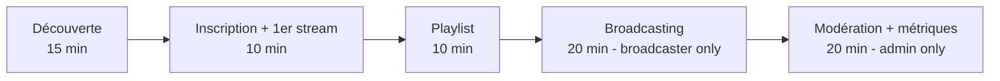

# Plan de formation utilisateurs — StreamPulse

| | |
|---|---|
| **Version** | 1.0.0 |
| **Langue** | Français (English version: [`PLAN_FORMATION-en.md`](./PLAN_FORMATION-en.md)) |
| **Couverture RNCP** | A3.6 — Ce3.6.5 |

> Ce plan de formation est conçu pour que chaque utilisateur — quel que soit son profil — puisse prendre en main l'application StreamPulse en autonomie. Il intègre des adaptations explicites pour les personnes en situation de handicap.

---

## Sommaire

1. [Profils utilisateurs](#1-profils-utilisateurs)
2. [Parcours progressif](#2-parcours-progressif)
3. [Guide auditeur](#3-guide-auditeur)
4. [Guide broadcaster](#4-guide-broadcaster)
5. [Guide administrateur](#5-guide-administrateur)
6. [Adaptations pour personnes en situation de handicap](#6-adaptations-pour-personnes-en-situation-de-handicap)
7. [FAQ](#7-faq)
8. [Ressources complémentaires](#8-ressources-complémentaires)

---

## 1. Profils utilisateurs

| Profil | Connaissances requises | Objectif après formation |
|---|---|---|
| **Auditeur (User)** | Aucune (usage smartphone basique) | Écouter, sauvegarder en favoris, créer des playlists |
| **Diffuseur (Broadcaster)** | Auditeur + notions de prise de son | Lancer un live, gérer son audience, téléverser un fichier |
| **Administrateur (Admin)** | Diffuseur + sensibilité modération | Gérer les utilisateurs, consulter les métriques, modérer |

---

## 2. Parcours progressif

**Durée estimée de formation complète :**
- Auditeur : ~ 35 minutes
- Broadcaster : ~ 55 minutes
- Administrateur : ~ 75 minutes

---

## 3. Guide auditeur

### 3.1 Installer l'application

1. Ouvrir l'**App Store** (iOS) ou le **Play Store** (Android).
2. Chercher *StreamPulse*.
3. Appuyer sur **Installer**.
4. Ouvrir l'application.

> 🔊 **Description audio** : *L'icône StreamPulse est ronde, fond bleu nuit, avec une onde sonore blanche au centre.*

### 3.2 Créer un compte

| Étape | Action | Pourquoi |
|---|---|---|
| 1 | Toucher *Créer un compte* | Démarrer l'inscription |
| 2 | Saisir un **email** valide | Sert d'identifiant de connexion |
| 3 | Choisir un **nom d'utilisateur** unique | Identité publique sur la plateforme |
| 4 | Choisir un **mot de passe** (≥ 8 caractères) | Sécurité du compte |
| 5 | Cocher *J'accepte la politique de confidentialité* | Conformité RGPD |
| 6 | Toucher *S'inscrire* | Création du compte + connexion automatique |

> ✅ Vous êtes redirigé vers l'écran d'accueil avec la liste des streams.

### 3.3 Écouter un stream live

1. Sur l'écran d'accueil, parcourir la liste des **streams en direct**.
   - 🔴 Un point rouge animé indique un stream live.
   - Le nombre d'auditeurs est affiché à droite du titre.
2. Toucher un stream pour démarrer la lecture.
3. Utiliser les contrôles :
   - **▶ / ⏸** : lecture / pause
   - **🔉 / 🔊** : ajuster le volume (boutons physiques du téléphone également)
   - **⏹** : arrêter et revenir à la liste

### 3.4 Lecture en arrière-plan

- Sortir de l'application **ne coupe pas** la lecture.
- Les contrôles sont disponibles depuis l'écran verrouillé et le centre de notifications.

### 3.5 Créer une playlist

1. Onglet *Bibliothèque* → bouton **+ Nouvelle playlist**.
2. Saisir un *nom* et une *description* (facultatif).
3. Toucher *Créer*.
4. Depuis la liste des tracks : appuyer longuement → *Ajouter à la playlist* → sélectionner.

### 3.6 Gérer son compte

- *Paramètres → Mon profil* : modifier email, nom d'utilisateur.
- *Paramètres → Vie privée → Exporter mes données* (droit d'accès RGPD).
- *Paramètres → Vie privée → Supprimer mon compte* (droit à l'oubli RGPD).

---

## 4. Guide broadcaster

### 4.1 Devenir broadcaster

Le rôle *Broadcaster* est attribué par un administrateur. Faire la demande depuis *Paramètres → Devenir diffuseur*.

### 4.2 Créer un stream

1. Onglet *Diffuser* → bouton **+ Nouveau stream**.
2. Saisir le **titre** et la **description** du programme.
3. Toucher *Créer le stream* → le stream est créé en statut `offline`.

### 4.3 Démarrer la diffusion

1. Vérifier le **niveau d'entrée micro** (barre VU visible à l'écran).
2. Autoriser l'accès au micro si demandé.
3. Toucher **🎙 Démarrer la diffusion**.
4. Le statut passe à `🔴 live`.

### 4.4 Suivre son audience

Pendant la diffusion :

- Nombre d'**auditeurs en temps réel**.
- **Durée** depuis le début de la diffusion.
- **Latence** indicative (réseau).

### 4.5 Arrêter une diffusion

Toucher **⏹ Arrêter** → confirmation → statut redevient `offline`. Les auditeurs reçoivent une notification de fin de stream.

### 4.6 Téléverser un fichier audio

1. Onglet *Bibliothèque → Mes tracks*.
2. Bouton **+ Téléverser**.
3. Sélectionner un fichier (`.mp3`, `.aac`, `.ogg` — max 50 Mo).
4. Renseigner *titre*, *artiste*, *durée détectée auto*.
5. Toucher *Téléverser*.

### 4.7 Bonnes pratiques de diffusion

- Connexion **Wi-Fi 5 GHz** ou 4G/5G stable (≥ 256 kbps upload).
- Micro à 10-15 cm de la bouche, environnement calme.
- Éviter les coupures : ne pas changer de réseau pendant la diffusion.
- Annoncer le contenu en début de stream pour les auditeurs qui arrivent.

---

## 5. Guide administrateur

### 5.1 Accéder à l'espace admin

L'onglet *Admin* n'est visible qu'avec le rôle `admin`. Si non visible : déconnexion / reconnexion.

### 5.2 Gérer les utilisateurs

| Action | Chemin |
|---|---|
| Lister tous les utilisateurs | *Admin → Utilisateurs* |
| Filtrer par rôle | Sélecteur en haut de la liste |
| Modifier le rôle | Toucher l'utilisateur → *Changer le rôle* |
| Désactiver un compte | Toucher l'utilisateur → *Désactiver* |

> ⚠️ La désactivation est **réversible**. La suppression définitive doit être demandée par l'utilisateur lui-même (droit à l'oubli RGPD).

### 5.3 Consulter le dashboard global

*Admin → Dashboard* affiche :

- Utilisateurs actifs (jour / semaine / mois)
- Streams actifs
- Listeners simultanés
- Taux d'erreurs HTTP
- Latence p95 de l'API

> Pour des dashboards techniques détaillés, ouvrir **Grafana** : `https://streampulse.<domaine>:3000` (accès réservé à l'équipe technique).

### 5.4 Modération du contenu

| Situation | Action |
|---|---|
| Signalement d'un stream inapproprié | Couper le stream + désactiver le compte broadcaster + envoyer un email d'avertissement |
| Comportement abusif persistant | Désactivation définitive (avec accord d'un second admin) |
| Violation RGPD (données personnelles divulguées) | Procédure incident — voir `docs/RGPD.md` § 8 |

### 5.5 Lire les feedbacks utilisateurs

*Admin → Feedbacks* liste les retours soumis depuis l'app. Ils alimentent la roadmap (Ce3.3.2).

---

## 6. Adaptations pour personnes en situation de handicap

### 6.1 Lecteurs d'écran (TalkBack / VoiceOver)

- Toute l'application est navigable au lecteur d'écran.
- Activation :
  - **iOS** : *Réglages → Accessibilité → VoiceOver → Activé*.
  - **Android** : *Paramètres → Accessibilité → TalkBack → Activé*.
- Tous les boutons, icônes et images porteuses de sens ont un **label sémantique** (ex. *« Bouton Lancer la lecture »*).

### 6.2 Instructions en texte clair

Toutes les étapes de ce guide sont rédigées en **phrases courtes**, sans jargon, avec un verbe d'action en début de phrase. Les captures d'écran sont **doublées d'une description textuelle**.

### 6.3 Navigation au clavier (tablette + clavier Bluetooth)

| Touche | Action |
|---|---|
| `Tab` / `Maj+Tab` | Élément suivant / précédent |
| `Entrée` | Activer |
| `Espace` | Lecture / pause |
| `Échap` | Retour arrière |
| `↑` / `↓` | Volume + / − |

### 6.4 Réglages visuels

- *Paramètres → Accessibilité → Taille du texte* : 4 tailles disponibles.
- *Paramètres → Accessibilité → Contraste élevé* (v1.1).
- Toutes les couleurs respectent un **contraste WCAG AA** (ratio ≥ 4.5:1).

### 6.5 Description audio des écrans

Une **transcription audio** de chaque écran est disponible sur la page documentation (`docs/ACCESSIBILITY.md`). Format :

> *« Écran d'accueil : en haut, une barre de recherche ; en dessous, une liste verticale de cartes représentant chaque stream live, avec titre, nom du broadcaster, nombre d'auditeurs. En bas, une barre de navigation avec quatre onglets. »*

### 6.6 Réduction des animations

Activer *Réduire les animations* dans les réglages système → l'application respecte automatiquement ce paramètre.

---

## 7. FAQ

### Compte et connexion

**Q : J'ai oublié mon mot de passe.**
R : *Connexion → Mot de passe oublié* → saisir l'email → un lien de réinitialisation est envoyé.

**Q : Comment changer mon email ?**
R : *Paramètres → Mon profil → Modifier l'email*. Un email de confirmation sera envoyé à la nouvelle adresse.

**Q : Comment supprimer mon compte ?**
R : *Paramètres → Vie privée → Supprimer mon compte*. La suppression est immédiate et **irréversible** (cascade RGPD).

### Lecture

**Q : Le son coupe régulièrement.**
R : Vérifier la **qualité du réseau** (passer en Wi-Fi). Si le problème persiste, redémarrer l'app.

**Q : Pourquoi le streaming s'arrête quand je verrouille l'écran ?**
R : Sur Android, autoriser *StreamPulse* en *Paramètres → Applications → StreamPulse → Économiseur de batterie → Pas de restriction*.

### Diffusion

**Q : Mon stream n'est pas visible par les auditeurs.**
R : Vérifier le statut : il doit être **`live`**. Sinon, toucher *Démarrer la diffusion*.

**Q : J'entends un écho.**
R : Couper le son de l'app sur d'autres appareils, ou utiliser un casque côté broadcaster.

### Administration

**Q : Comment promouvoir un utilisateur en broadcaster ?**
R : *Admin → Utilisateurs → choisir l'utilisateur → Changer le rôle → Broadcaster*.

**Q : Comment exporter les logs ?**
R : Pour les admins techniques uniquement : connexion à Grafana → Explore → Loki → filtre par date.

---

## 8. Ressources complémentaires

| Ressource | Lien |
|---|---|
| Cahier des charges FR | [`cahier-des-charges-fr.md`](./cahier-des-charges-fr.md) |
| Politique de confidentialité (RGPD) | [`RGPD.md`](./RGPD.md) |
| Accessibilité | [`ACCESSIBILITY.md`](./ACCESSIBILITY.md) |
| Support | `contact@ecole-decode.fr` |

### Tutoriels vidéo *(à produire)*

- 🎬 *Premiers pas avec StreamPulse* — 3 min
- 🎬 *Devenir broadcaster en 5 minutes* — 5 min
- 🎬 *Modération et métriques pour les admins* — 8 min

Chaque vidéo est :

- **sous-titrée** en français et en anglais ;
- accompagnée d'une **transcription textuelle** ;
- accompagnée d'une **description audio** (audio-description) pour les personnes malvoyantes.

### Glossaire

Voir [`cahier-des-charges-fr.md` § 2](./cahier-des-charges-fr.md#2-glossaire).
