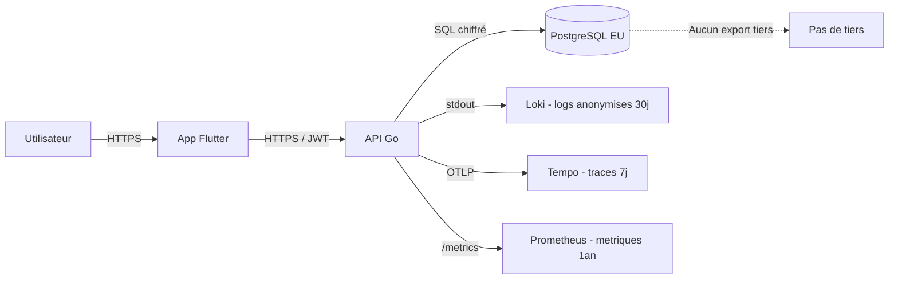

# Registre RGPD — StreamPulse

| | |
|---|---|
| **Version** | 1.0.0 |
| **Couverture RNCP** | A3.1 — Ce3.1.4 |
| **Base légale principale** | Article 6.1.b du RGPD (exécution du contrat de service) |
| **Statut** | Adopté |

> Ce document constitue le **registre simplifié des activités de traitement** au sens de l'article 30 du RGPD. Il documente les données collectées, les finalités, les durées de conservation, les droits des personnes et les mesures de sécurité.

---

## 1. Identité du responsable de traitement

| Champ | Valeur |
|---|---|
| Organisme | École .decode (cadre académique) |
| Équipe projet | StreamPulse — 5A Tech Lead |
| Contact | `contact@ecole-decode.fr` |
| DPO délégué *(simulé)* | Équipe StreamPulse |

> Dans un contexte de mise en production réelle, l'organisme exploitant désignerait un DPO et publierait une politique de confidentialité publique.

---

## 2. Cartographie des données traitées

| Donnée | Finalité | Base légale | Catégorie | Durée de conservation |
|---|---|---|---|---|
| Email | Identification, login, contact technique | Exécution du contrat | Donnée d'identification | 3 ans après dernière activité |
| Nom d'utilisateur (`username`) | Identification publique | Exécution du contrat | Donnée d'identification | 3 ans après dernière activité |
| Mot de passe (hash bcrypt) | Authentification | Exécution du contrat | Donnée d'authentification | Tant que le compte existe |
| Rôle (`anonymous`/`user`/`broadcaster`/`admin`) | Contrôle d'accès | Exécution du contrat | Donnée technique | Tant que le compte existe |
| Date d'inscription / dernière activité | Détection inactivité, statistiques | Intérêt légitime | Donnée technique | 3 ans après dernière activité |
| Streams créés | Fourniture du service | Exécution du contrat | Contenu utilisateur | Tant que le compte existe |
| Playlists et tracks téléversés | Fourniture du service | Exécution du contrat | Contenu utilisateur | Tant que le compte existe |
| Historique d'écoute *(optionnel v1.1)* | Personnalisation / recommandation | Consentement | Donnée d'usage | 12 mois |
| Logs techniques (IP hashée, user-agent) | Sécurité, observabilité | Intérêt légitime | Donnée technique | 30 jours |
| Métriques agrégées (listeners, latence) | Performance | Intérêt légitime | Donnée anonyme | 1 an |

### Données **non** collectées

- Localisation GPS précise.
- Contenu des conversations (pas de chat en v1.0.0).
- Données de paiement (pas de monétisation).
- Données sensibles (origine, santé, religion, opinions politiques).

---

## 3. Flux et destinataires



**Aucune donnée personnelle n'est transmise à un tiers** dans la version 1.0.0. L'infrastructure cible est hébergée dans l'Union Européenne (Fly.io région CDG, OVH Cloud, Scaleway).

---

## 4. Droits des personnes

### Droits implémentés

| Droit | Article | Implémentation |
|---|---|---|
| **Droit d'accès** | Art. 15 | `GET /api/v1/users/me/data` → export JSON complet |
| **Droit à l'effacement** | Art. 17 | `DELETE /api/v1/users/me` → suppression cascade |
| **Droit de rectification** | Art. 16 | `PUT /api/v1/users/me` |
| **Droit à la portabilité** | Art. 20 | Export JSON (même endpoint que droit d'accès) |
| **Droit d'opposition** | Art. 21 | Désinscription = suppression compte |
| **Droit à la limitation** | Art. 18 | Désactivation du compte (admin) |

### Délai de réponse

- **Automatique** via l'API : effet immédiat.
- **Manuel** (via support email) : sous 30 jours maximum.

### Endpoint d'export — exemple de payload

```json
{
  "user": {
    "id": "uuid",
    "email": "alice@example.com",
    "username": "alice",
    "role": "user",
    "created_at": "2026-01-15T10:00:00Z"
  },
  "streams": [...],
  "playlists": [...],
  "tracks_uploaded": [...],
  "feedback": [...]
}
```

### Suppression en cascade

```sql
DELETE FROM users WHERE id = ?;
-- Déclenche en cascade :
-- - DELETE FROM streams WHERE broadcaster_id = ?
-- - DELETE FROM playlists WHERE owner_id = ?
-- - DELETE FROM tracks WHERE upload_by = ?
-- - DELETE FROM feedbacks WHERE user_id = ?
```

Les fichiers audio téléversés sont supprimés du stockage objet (local ou S3) dans la même transaction logique.

---

## 5. Consentement

### À l'inscription

L'utilisateur doit cocher explicitement :

- ✅ J'ai lu et j'accepte la politique de confidentialité.
- ✅ J'accepte les conditions générales d'utilisation.
- ⚪ *(optionnel)* J'accepte de recevoir des recommandations basées sur mon historique d'écoute.

Le consentement est tracé en base : `users.consent_terms_at`, `users.consent_recommendations_at` (timestamp ou `NULL`).

### Retrait du consentement

À tout moment depuis l'écran *Paramètres → Vie privée* dans l'application mobile.

---

## 6. Sécurité des données

| Mesure | Implémentation |
|---|---|
| Chiffrement en transit | TLS 1.2+ obligatoire en production |
| Chiffrement au repos | PostgreSQL avec disque chiffré ; sauvegardes chiffrées |
| Mots de passe | bcrypt, coût ≥ 12, jamais en clair |
| Tokens côté mobile | `flutter_secure_storage` (Keychain / Keystore) |
| Logs | IP hashée, email anonymisé, aucun mot de passe ni JWT loggé |
| Accès admin | Authentification + journalisation des actions |
| Sauvegardes | Quotidiennes, chiffrées, rétention 30 jours |
| Tests sécurité | `govulncheck`, `trivy`, `gitleaks` dans la CI |
| Headers HTTP | `X-Content-Type-Options`, `X-Frame-Options`, `Content-Security-Policy` |
| Rate limiting | 10 tentatives/min sur `/auth/*` |

---

## 7. Anonymisation des logs

Le middleware de logging applique systématiquement :

```go
// Pseudo-code illustratif
func anonymize(req *http.Request) map[string]any {
    return map[string]any{
        "ip_hash":   sha256(req.RemoteAddr + dailySalt()),
        "user_id":   req.Context().Value("user_id"),  // jamais l'email
        "method":    req.Method,
        "path":      sanitizePath(req.URL.Path),       // pas d'IDs sensibles
        "status":    res.StatusCode,
        "duration":  duration,
        "trace_id":  traceID,
    }
}
```

**Aucun log ne contient :** mot de passe, email, JWT complet, contenu de payload sensible.

---

## 8. Violations de données

### Procédure interne

1. **Détection** — alerte Grafana sur métriques anormales OU rapport externe.
2. **Acknowledge** — équipe ouvre un incident haute priorité.
3. **Confinement** — révocation immédiate des secrets compromis, déploiement correctif.
4. **Analyse** — diagnostic via logs Loki + traces Tempo, identification du périmètre.
5. **Notification CNIL** — sous **72 h** si risque pour les personnes (art. 33 RGPD).
6. **Notification utilisateurs** — si risque élevé (art. 34 RGPD).
7. **Post-mortem** — ADR + entrée changelog + mesures correctives durables.

### Contact violation

`contact@ecole-decode.fr` (mention « INCIDENT SÉCURITÉ »).

---

## 9. Durée de rétention — règle automatique

Un job planifié purge :

- Comptes inactifs depuis > 3 ans → notification 30 jours avant suppression.
- Logs Loki > 30 jours → purge automatique.
- Traces Tempo > 7 jours → purge automatique.
- Sauvegardes > 30 jours → purge automatique.

Implémentation prévue dans `backend/cmd/retention/`.

---

## 10. Sous-traitants et hébergement

| Sous-traitant *(à valider en production)* | Rôle | Localisation | Garanties |
|---|---|---|---|
| Hébergeur cloud (Fly.io / OVH / Scaleway) | Hébergement infra | UE | DPA RGPD signé |
| Let's Encrypt | TLS | UE/US | Service public, pas de données utilisateurs |
| GitHub | Code source | US | DPA + clauses contractuelles types |

> En version académique, aucune donnée réelle d'utilisateurs n'est traitée. Les présentes mentions s'appliqueraient en cas de mise en production réelle.

---

## 11. Mentions légales (extrait pour l'app)

À afficher dans l'écran *Paramètres → À propos* :

```
StreamPulse v1.0.0
Projet pédagogique École .decode — 5A Tech Lead — RNCP 38822
Contact : contact@ecole-decode.fr
Hébergement : <hébergeur cible>
Politique de confidentialité : <URL>
Conditions d'utilisation : <URL>
```

---

## 12. Historique du registre

| Version | Date | Changements |
|---|---|---|
| 1.0.0 | 2026-06-01 | Création du registre, aligné sur la v1.0.0 de la solution. |
