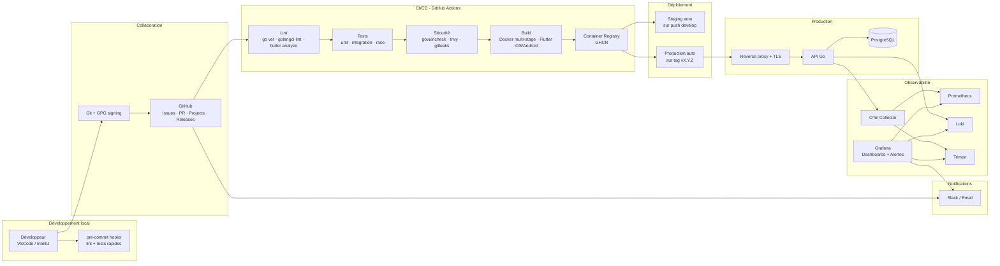
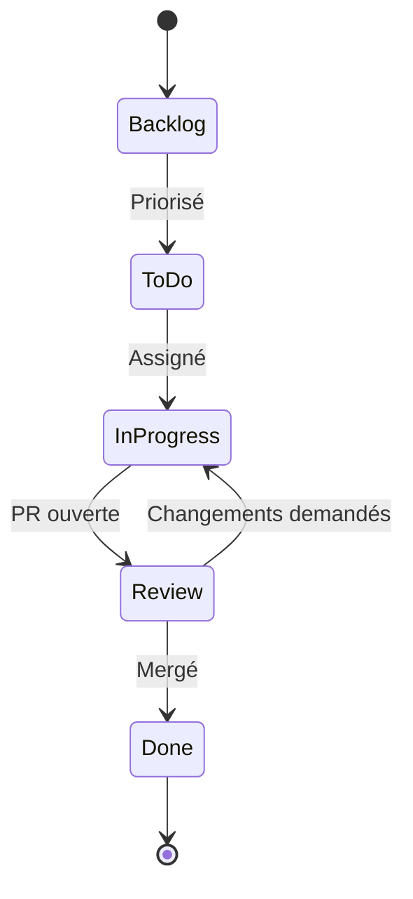

# Chaîne d'outils intégrée — StreamPulse

| | |
|---|---|
| **Version** | 1.0.0 |
| **Couverture RNCP** | A3.5 — Ce3.5.3 (chaîne d'outils intégrée, automatisation, travail collaboratif) |
| **Statut** | Adopté |

> Ce document décrit la **chaîne d'outils complète** (du clavier du développeur jusqu'à l'utilisateur en production), les automatisations, les notifications et le mode de collaboration de l'équipe.

---

## 1. Vue d'ensemble

---

## 2. Détail par étape

### 2.1 Développement local

| Outil | Rôle |
|---|---|
| **VSCode / IntelliJ / Android Studio** | IDE recommandés |
| **Docker + Docker Compose** | Stack locale identique à la prod |
| **gopls** | LSP Go |
| **dart-language-server** | LSP Dart |
| **golangci-lint** | Lint Go en local |
| **flutter analyze** | Lint Dart |
| **pre-commit hooks** *(optionnel)* | `gofmt`, `flutter format`, `gitleaks`, conventional-commits |
| **mockgen / mocktail** | Génération de mocks |
| **k6** | Tests de charge locaux |

### 2.2 Collaboration

| Outil | Rôle |
|---|---|
| **GitHub Repository** | Source unique de vérité |
| **GitHub Issues** | Suivi des bugs et user stories |
| **GitHub Projects** | Board Kanban (Backlog · To Do · In Progress · Review · Done) |
| **GitHub Pull Requests** | Code review obligatoire |
| **GitHub Discussions** *(optionnel)* | Décisions ouvertes, RFC |
| **GitHub Releases** | Notes de version liées au CHANGELOG |
| **Dependabot** | Mise à jour automatique des dépendances |
| **GPG signing** | Authentification cryptographique des commits |

### 2.3 CI/CD — GitHub Actions

Trois workflows principaux :

#### `ci-backend.yml`
- Trigger : push / PR touchant `backend/**`
- Jobs : `go vet` → `golangci-lint` → `go test -race -cover` → `govulncheck` → upload coverage

#### `ci-frontend.yml`
- Trigger : push / PR touchant `frontend/**`
- Jobs : `flutter analyze` → `flutter test --coverage` → build APK + AppBundle + iOS (no-sign)

#### `cd-deploy.yml`
- Trigger : push sur `develop` → staging ; tag `v*` → production
- Jobs : build Docker multi-stage → `trivy scan` → push GHCR → déploiement → smoke tests

#### `security-scan.yml`
- Trigger : cron quotidien + PR
- Jobs : `gitleaks` → `govulncheck` → `trivy image` → rapport sécurité archivé

Tous les workflows sont versionnés dans `.github/workflows/`.

### 2.4 Container registry

**GitHub Container Registry (GHCR)** :

- `ghcr.io/<org>/streampulse-api:<sha>` (par build)
- `ghcr.io/<org>/streampulse-api:latest` (dernière `main`)
- `ghcr.io/<org>/streampulse-api:v1.0.0` (releases)

### 2.5 Déploiement

| Environnement | Trigger | Plateforme cible *(au choix)* | URL |
|---|---|---|---|
| **Staging** | Merge sur `develop` | Fly.io / VPS / GCP Cloud Run | `https://staging.streampulse.<domaine>` |
| **Production** | Tag `v*` sur `main` | Idem | `https://streampulse.<domaine>` |

Choix documenté dans `docs/adr/0007-deployment-platform.md`.

### 2.6 Observabilité — la chaîne complète

| Signal | Émis par | Collecté par | Stocké dans | Visualisé via |
|---|---|---|---|---|
| Traces OTLP | `otel-go-sdk` | OTel Collector | Tempo | Grafana |
| Métriques Prometheus | `prometheus/client_golang` | Prometheus scrape | Prometheus | Grafana |
| Métriques OTLP | `otel-go-sdk` | OTel Collector | Prometheus (remote-write) | Grafana |
| Logs JSON | `slog` (stdout) | Promtail | Loki | Grafana |

### 2.7 Alerting

| Source | Canal | Quand |
|---|---|---|
| GitHub Actions échec CI | Slack `#streampulse-ci` + email | Build cassé |
| Dependabot vulnérabilité | Slack + GitHub Security | Détection |
| Grafana alerte error rate | Slack `#streampulse-incidents` | > 5 % d'erreurs 5xx |
| Grafana alerte latence | Slack | p95 > 1 s pendant 5 min |
| Grafana alerte streams | Slack | listeners > 1000 ou streams down |

Configuration : `deployments/grafana/alerts.yml`.

---

## 3. Workflow collaboratif

### 3.1 Cycle de vie d'un ticket

### 3.2 Rituels

| Rituel | Fréquence | Durée | Objectif |
|---|---|---|---|
| Daily | Quotidien (sauf cours) | 10 min | Synchronisation, blocages |
| Sprint planning | Bi-hebdo | 1 h | Planification |
| Demo / Review | Bi-hebdo | 30 min | Démo des features livrées |
| Retro | Bi-hebdo | 30 min | Amélioration continue |
| Pair / Mob programming | Au besoin | — | Diffusion de connaissance |

### 3.3 Définition « Ready »

Un ticket est *ready* quand :

- L'US est claire (format *« en tant que… je veux… afin de… »*).
- Les critères d'acceptation sont listés.
- Les dépendances sont identifiées.
- Le ticket RNCP couvert est tagué.
- Estimation faite.

### 3.4 Définition « Done »

Un ticket est *done* quand :

- Code mergé sur `develop`.
- CI verte.
- Tests automatisés ajoutés (unit + intégration si pertinent).
- Documentation mise à jour (README / ADR / CHANGELOG).
- Cahier de recette mis à jour.
- Démo possible en staging.

---

## 4. Outils par rôle / matrice RACI

| Tâche | Backend | Frontend | DevOps | QA / Doc |
|---|:---:|:---:|:---:|:---:|
| Implémentation features | R/A | R/A | C | I |
| CI/CD | R | C | R/A | C |
| Tests | R/A | R/A | C | R |
| Documentation | R | R | R | A |
| Déploiement | C | I | R/A | I |
| Observabilité | R | I | R/A | C |
| Sécurité | R | C | R/A | C |
| Code review | R | R | R | C |

*R = Responsable · A = Accountable · C = Consulté · I = Informé*

---

## 5. Onboarding d'un nouveau contributeur

Parcours estimé : **2 heures** pour être productif.

1. Cloner le repo, lire le `README.md`.
2. Configurer GPG (`docs/GIT_STRATEGY.md`).
3. `cp .env.example .env` puis `docker compose up -d`.
4. Lancer le backend : `cd backend && go run ./cmd/api`.
5. Lancer l'app mobile : `cd frontend && flutter run`.
6. Lire `CONTRIBUTING.md` + `docs/PLAN_DE_TESTS.md`.
7. Prendre un ticket marqué `good first issue`.

---

## 6. Indicateurs de la chaîne (DORA-like)

| Indicateur | Cible | Mesure |
|---|---|---|
| Lead time *(commit → prod)* | < 1 jour | GitHub Actions logs |
| Deployment frequency | ≥ 1/jour ouvré sur staging | CI/CD logs |
| Change failure rate | < 15 % | rollbacks / deploys |
| MTTR *(time to restore)* | < 1 h | Incidents Slack |
| % commits signés | 100 % | `git log --pretty="%G?"` |

---

## 7. Évolutions prévues

| # | Évolution | Sprint cible |
|---|---|---|
| 1 | Migrer staging vers Kubernetes (TICK-102 bonus) | Post-MVP |
| 2 | Ajouter `renovate.json` plus fin que Dependabot | S5 |
| 3 | Ajouter benchmark visuel sur le dashboard Grafana | S5 |
| 4 | Pipeline de release automatique (release-please) | S6 |

---

## 8. Annexes

- [`docs/adr/0006-observability-stack.md`](./adr/0006-observability-stack.md)
- [`docs/adr/0007-deployment-platform.md`](./adr/0007-deployment-platform.md)
- [Documentation GitHub Actions](https://docs.github.com/en/actions)
- [The Twelve-Factor App](https://12factor.net/fr/)
- [DORA metrics](https://dora.dev/)
