# Technical Specifications — StreamPulse

| | |
|---|---|
| **Project** | StreamPulse — Real-time audio streaming platform |
| **Document version** | 1.0.0 |
| **Solution version described** | v1.0.0 |
| **Academic context** | .decode School — 5A Tech Lead, S2 Block 3 (RNCP 38822) |
| **Year** | 2025–2026 |
| **Language** | English (French version: [`cahier-des-charges-fr.md`](./cahier-des-charges-fr.md)) |

> This document describes the complete functional, technical, security and architectural specifications of the **StreamPulse** solution. It acts as a contractual reference between the project team and the RNCP jury.

---

## Table of contents

1. [Context and goals](#1-context-and-goals)
2. [Glossary](#2-glossary)
3. [Functional scope and actors](#3-functional-scope-and-actors)
4. [User stories](#4-user-stories)
5. [Technical specifications](#5-technical-specifications)
6. [Overall architecture](#6-overall-architecture)
7. [Data model and database schema](#7-data-model-and-database-schema)
8. [General security overview](#8-general-security-overview)
9. [UML diagrams](#9-uml-diagrams)
10. [BPMN diagrams](#10-bpmn-diagrams)
11. [Non-functional requirements](#11-non-functional-requirements)
12. [Constraints and limitations](#12-constraints-and-limitations)
13. [Appendices](#13-appendices)

---

## 1. Context and goals

### 1.1 Business context

The streaming industry and live content broadcasting market keep growing. Use cases include digital radios, live podcasts, online DJ sessions, and industrial audio monitoring. All these areas require an infrastructure able to handle massive data flows with minimal latency and high availability.

### 1.2 Problem statement

> *How can we design a real-time audio streaming platform able to serve N simultaneous listeners from a single source, while ensuring the observability, resilience and regulatory compliance expected from a production-grade product?*

### 1.3 Project goals

| Goal | Description |
|---|---|
| **G1 — Real-time streaming** | Broadcast an audio stream from a *broadcaster* to N *listeners* with low latency. |
| **G2 — Multi-role system** | Manage four profiles (anonymous, user, broadcaster, administrator) with distinct rights. |
| **G3 — Observability** | Provide full visibility through traces (OpenTelemetry), metrics (Prometheus) and logs (Loki). |
| **G4 — Industrialization** | Containerize, automate the CI/CD pipeline, externalize configuration (12-Factor App). |
| **G5 — Cross-platform mobile** | Deliver a Flutter application running on both iOS and Android. |
| **G6 — Compliance** | Respect GDPR, secure communications (TLS), follow OWASP best practices. |

### 1.4 RNCP 38822 — Block 3 scope

This project addresses the competency *"Drive the deployment of software solutions and their evolution"*. Six activities are covered:

- **A3.1** — Code change integration (CI, version control)
- **A3.2** — Automated testing
- **A3.3** — Continuous monitoring of updates
- **A3.4** — Automated distribution (CD)
- **A3.5** — Continuous operations across the DevOps lifecycle
- **A3.6** — Technical documentation authoring

---

## 2. Glossary

| Term | Definition |
|---|---|
| **Broadcaster** | User allowed to publish a live audio stream. |
| **Listener** | User (anonymous or authenticated) who consumes an audio stream. |
| **Stream** | Live audio flow broadcast by a broadcaster. |
| **Track** | Recorded audio file that can be added to a playlist. |
| **Playlist** | Ordered list of tracks owned by a user. |
| **Hub** | Software component that multiplexes a source flow towards several subscribers using a pub/sub pattern. |
| **JWT** | JSON Web Token, used for stateless authentication. |
| **OTEL** | OpenTelemetry, standard instrumentation framework for traces, metrics and logs. |
| **12-Factor App** | Methodology for building cloud-native applications. |
| **ADR** | Architecture Decision Record, document justifying a technical choice. |
| **BLoC** | Business Logic Component, state management pattern used in Flutter. |
| **DDD** | Domain-Driven Design, design approach focused on the business domain. |
| **SRE** | Site Reliability Engineering, discipline of reliability engineering. |
| **RNCP** | French National Register of Professional Certifications. |
| **GDPR** | General Data Protection Regulation. |

---

## 3. Functional scope and actors

### 3.1 System actors

| Actor | Technical role | Description |
|---|---|---|
| **Anonymous** | `anonymous` | Unauthenticated visitor. Can browse the public stream list and listen without favorites. |
| **User** | `user` | Registered account. Can listen, manage favorites, create and organize playlists. |
| **Broadcaster** | `broadcaster` | Extended user. Can create live streams and upload audio files. |
| **Administrator** | `admin` | Manages users, accesses global metrics and moderates content. |

### 3.2 Capability matrix

| Capability | Anonymous | User | Broadcaster | Admin |
|---|:---:|:---:|:---:|:---:|
| Listen to a public stream | ✅ | ✅ | ✅ | ✅ |
| Register / Log in | ✅ | — | — | — |
| Mark a stream as favorite | ❌ | ✅ | ✅ | ✅ |
| Create a playlist | ❌ | ✅ | ✅ | ✅ |
| Create a live stream | ❌ | ❌ | ✅ | ✅ |
| Upload an audio file | ❌ | ❌ | ✅ | ✅ |
| Manage users | ❌ | ❌ | ❌ | ✅ |
| Access global metrics | ❌ | ❌ | ❌ | ✅ |

---

## 4. User stories

> Each user story follows the format *"As a [role], I want [action] so that [benefit]"* and carries an identifier `US-XXX` reused in the acceptance test plan and functional tests.

### 4.1 Authentication and profile

- **US-001** — As an **anonymous user**, I want to register with an email, a username and a password so that I can create a personal account.
  - *Acceptance criteria*: unique email, password length ≥ 8 characters, JWT returned on success, HTTP 409 if duplicate.
- **US-002** — As a **user**, I want to log in with my credentials so that I can access my personal space.
  - *Acceptance criteria*: JWT returned, configurable expiration, HTTP 401 if invalid.
- **US-003** — As a **user**, I want to view and update my profile so that my information stays accurate.
- **US-004** — As a **user**, I want to delete my account so that I can exercise my right to be forgotten (GDPR).
- **US-005** — As a **user**, I want to export my personal data so that I can exercise my right of access (GDPR).

### 4.2 Listening and discovery

- **US-010** — As a **listener**, I want to browse the list of live streams so that I can find content to listen to.
- **US-011** — As a **listener**, I want to play a live stream so that I can enjoy a real-time audio flow.
- **US-012** — As a **listener**, I want to control playback (play, pause, volume) so that I can personalize my experience.
- **US-013** — As a **listener**, I want playback to continue in the background so that I can use other applications in parallel.

### 4.3 Playlists and tracks

- **US-020** — As a **user**, I want to create a playlist so that I can organize my favorite tracks.
- **US-021** — As a **user**, I want to add or remove a track from a playlist so that I can update it.
- **US-022** — As a **user**, I want to reorder the tracks in a playlist so that I can define a play order.
- **US-023** — As a **user**, I want to play a playlist continuously so that I can listen to several tracks without intervention.

### 4.4 Broadcasting

- **US-030** — As a **broadcaster**, I want to create a stream so that I can announce an upcoming broadcasting session.
- **US-031** — As a **broadcaster**, I want to start the audio broadcast from my device so that I can stream live.
- **US-032** — As a **broadcaster**, I want to stop the broadcast at any time so that I can end the session cleanly.
- **US-033** — As a **broadcaster**, I want to see the listener count in real time so that I can measure my audience.
- **US-034** — As a **broadcaster**, I want to upload an audio file so that I can enrich the track catalog.

### 4.5 Administration

- **US-040** — As an **admin**, I want to list all users so that I can have a complete view of the platform.
- **US-041** — As an **admin**, I want to change a user's role so that I can grant or revoke privileges.
- **US-042** — As an **admin**, I want to disable an account so that I can answer abuse reports.
- **US-043** — As an **admin**, I want to consult the global dashboard so that I can monitor the system health.
- **US-044** — As an **admin**, I want to read user feedback so that I can guide the product roadmap.

### 4.6 Cross-cutting

- **US-050** — As a **user**, I want to submit feedback so that I can report an issue or suggest an improvement.
- **US-051** — As a **user with disabilities**, I want to navigate the application using a screen reader so that I can use the service autonomously.

---

## 5. Technical specifications

### 5.1 Technology stack

#### Backend

| Layer | Technology | Version | Justification |
|---|---|---|---|
| Language | Go | 1.22+ | Performance, native concurrency through goroutines. |
| HTTP framework | Gin | v1.10 | Lightweight, mature, rich middleware ecosystem. |
| ORM | GORM | v1.25 | Standard in the Go ecosystem, native PostgreSQL support. |
| Database | PostgreSQL | 16 | Relational, robust, JSONB support. |
| Authentication | JWT (`golang-jwt/jwt`) | v5 | Stateless, scalable. |
| Password hashing | `bcrypt` | — | Industry standard, resistant to brute-force attacks. |
| Configuration | Viper | v1.18 | Supports .env files, env variables, hierarchy. |
| Logging | `log/slog` (stdlib) | Go 1.22+ | Native JSON support, high performance. |
| Traces | OpenTelemetry Go SDK | v1.24 | CNCF standard. |
| Metrics | `prometheus/client_golang` | v1.19 | Market standard. |

#### Mobile frontend

| Layer | Technology | Version | Justification |
|---|---|---|---|
| Framework | Flutter | 3.22+ | Single codebase for iOS and Android. |
| Language | Dart | 3.4+ | Sound null safety, strong performance. |
| State management | flutter_bloc | v8 | Explicit, predictable, testable. |
| Routing | go_router | v14 | Declarative routing with deep linking. |
| Audio | just_audio + audio_service | v0.9 / v0.18 | HTTP streaming + background playback. |
| HTTP | Dio | v5 | JWT interceptors, retries, timeouts. |
| Secure storage | flutter_secure_storage | v9 | iOS Keychain / Android Keystore. |

#### Infrastructure and observability

| Component | Tool |
|---|---|
| Containerization | Docker (multi-stage, Alpine final image) |
| Local orchestration | Docker Compose |
| Metrics | Prometheus |
| Visualization | Grafana |
| Centralized logs | Loki |
| Telemetry collector | OpenTelemetry Collector |
| Traces | Tempo (or Jaeger) |
| CI/CD | GitHub Actions |

### 5.2 12-Factor App methodology

The application follows all twelve factors, notably:

- **III. Config** — every sensitive or environment-dependent value is injected through environment variables (`DATABASE_URL`, `JWT_SECRET`, `OTEL_ENDPOINT`, etc.). A `.env.example` file documents the full list of variables.
- **IV. Backing services** — PostgreSQL and the OTEL collector are consumed as interchangeable resources through their URL.
- **VI. Processes** — the Go API is stateless; persistent data always goes through PostgreSQL.
- **XI. Logs** — logs are written to `stdout` as JSON and aggregated by Loki.

### 5.3 Code conventions

- Go: `go fmt`, `go vet`, `golangci-lint`, table-driven tests with `testify`.
- Dart/Flutter: `flutter analyze`, effective_dart conventions, `bloc_test` and `flutter_test`.
- Commits: **Conventional Commits** (`feat:`, `fix:`, `docs:`, `ci:`, ...), GPG-signed.

---

## 6. Overall architecture

### 6.1 Overview (C4 — Container level)

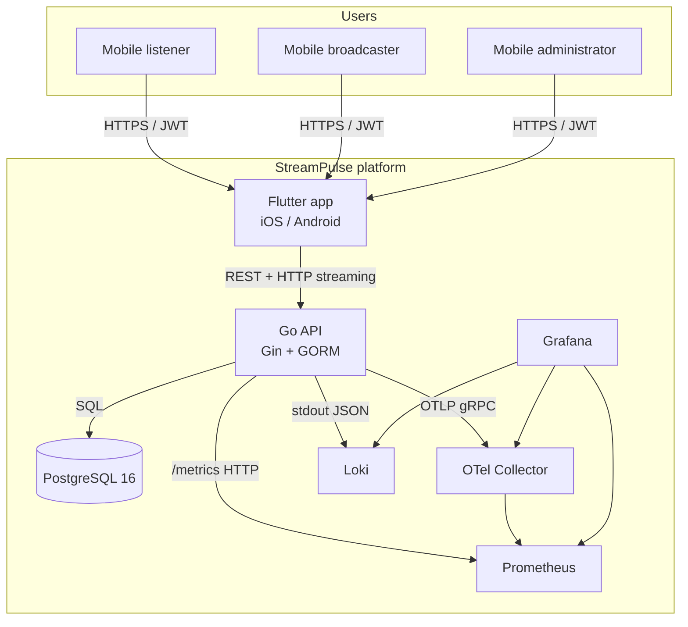

### 6.2 Backend internal architecture (Clean Architecture / DDD)

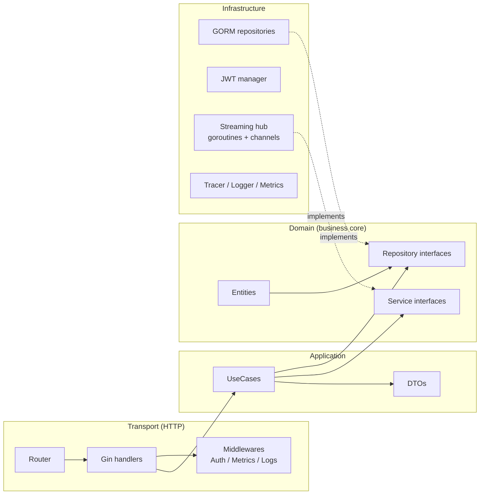

**Dependency rule**: `domain` has no external dependency; `application` depends only on the `domain`; `infrastructure` and `transport` depend on both `domain` and `application`.

### 6.3 Frontend architecture (Feature-based + BLoC)

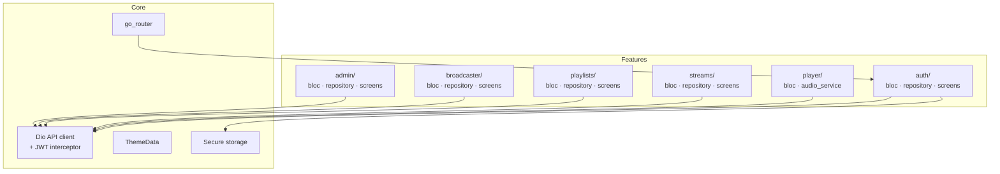

---

## 7. Data model and database schema

### 7.1 Entity-relationship diagram (ERD)

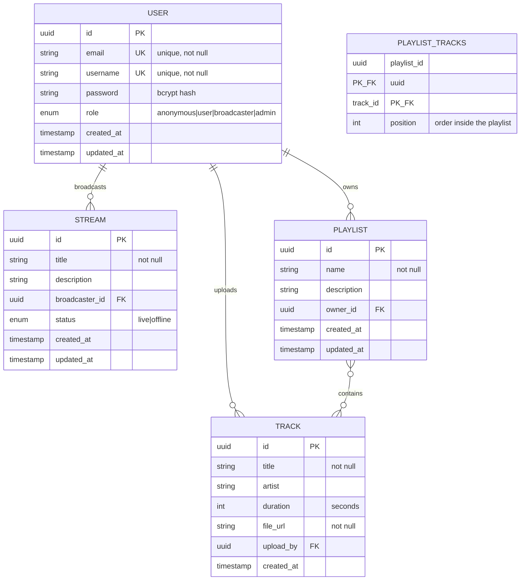

### 7.2 Table descriptions

| Table | Description | Notable indexes |
|---|---|---|
| `users` | User accounts and roles. | `email` UNIQUE, `username` UNIQUE |
| `streams` | Live broadcasting sessions. | `broadcaster_id`, `status` |
| `playlists` | Track lists owned by a user. | `owner_id` |
| `tracks` | Metadata of audio files. | `upload_by` |
| `playlist_tracks` | Many-to-many join table. | `(playlist_id, track_id)` |
| `feedbacks` *(planned)* | User feedback (rating, comment). | `user_id` |

### 7.3 Integrity constraints

- Deleting a user cascades to their streams, playlists and tracks (GDPR right to erasure).
- All identifiers are UUID v4 generated by the database through `gen_random_uuid()`.
- All queries flow through GORM, which automatically parametrizes SQL statements (SQL injection protection).

---

## 8. General security overview

### 8.1 High-level view

```mermaid
graph TB
    CLIENT[Flutter mobile client]
    LB[Reverse proxy / TLS<br/>Let's Encrypt]
    API[Go API]
    DB[(PostgreSQL)]

    CLIENT -->|HTTPS TLS 1.2+| LB
    LB -->|Internal HTTP| API
    API -->|TLS<br/>encrypted credentials| DB

    subgraph "API security measures"
        M1[Mandatory JWT bearer<br/>on protected routes]
        M2[Rate limiting<br/>/auth/*]
        M3[Security headers<br/>X-Frame-Options, CSP]
        M4[Input validation]
        M5[Strict CORS in prod]
        M6[/metrics protected]
    end

    API --- M1
    API --- M2
    API --- M3
    API --- M4
    API --- M5
    API --- M6
```

### 8.2 Authentication and authorization

- **Passwords**: hashed using `bcrypt` (cost factor ≥ 12), never returned by the API (`json:"-"`).
- **JWT**: HMAC-SHA256 signature, secret of at least 32 characters injected through `JWT_SECRET`, configurable lifetime (24 h by default).
- **Claims**: `sub` (user_id), `role`, `iat`, `exp`.
- **Middleware**: `AuthMiddleware` extracts and validates the token; `RequireRole(role...)` checks the role.

### 8.3 Communication protection

- TLS 1.2 minimum, TLS termination handled by a reverse proxy (Traefik / Caddy / Nginx).
- HTTP → HTTPS redirection enforced in production.
- Target: SSL Labs grade ≥ A.

### 8.4 Data protection

| Data | Protection |
|---|---|
| Password | bcrypt hash, never stored in clear text |
| JWT on mobile | `flutter_secure_storage` (Keychain / Keystore) |
| Email in logs | Anonymized / masked |
| IP address | Hashed before being logged |
| User data in transit | TLS encryption |

### 8.5 GDPR compliance

- **Explicit consent** required at registration.
- **Right of access**: endpoint `GET /api/v1/users/me/data` (JSON export).
- **Right to be forgotten**: endpoint `DELETE /api/v1/users/me` (cascading deletion).
- **Records of processing activities**: `docs/RGPD.md`.
- **Data retention**: 3 years after last activity, then automatic deletion.

### 8.6 CI/CD pipeline security

- Go dependency scanning: `govulncheck` on every pull request.
- Docker image scanning: `trivy` on every build.
- Secret leakage audit: `gitleaks` in CI.
- Dependabot enabled on the GitHub repository.

---

## 9. UML diagrams

### 9.1 Class diagram (domain)

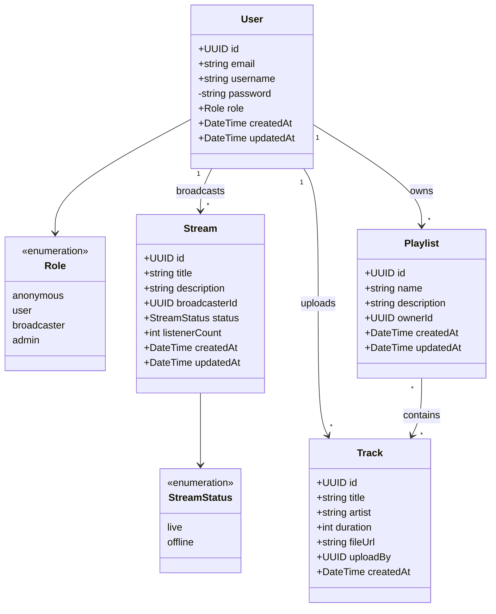

### 9.2 Use case diagram

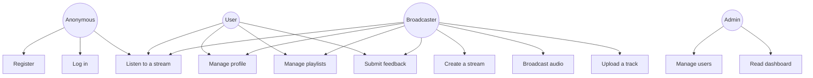

### 9.3 Sequence diagram — Registration then login

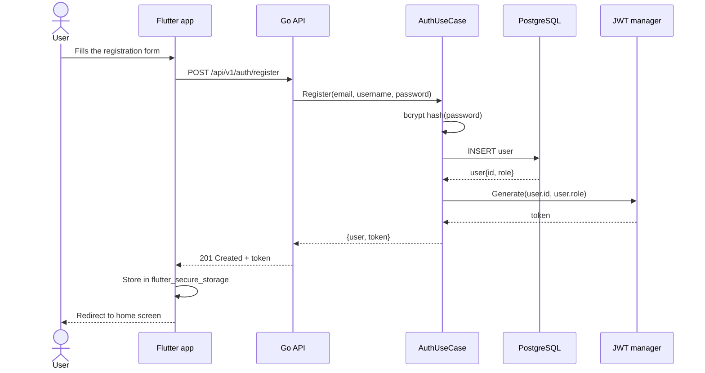

### 9.4 Sequence diagram — Broadcasting an audio stream

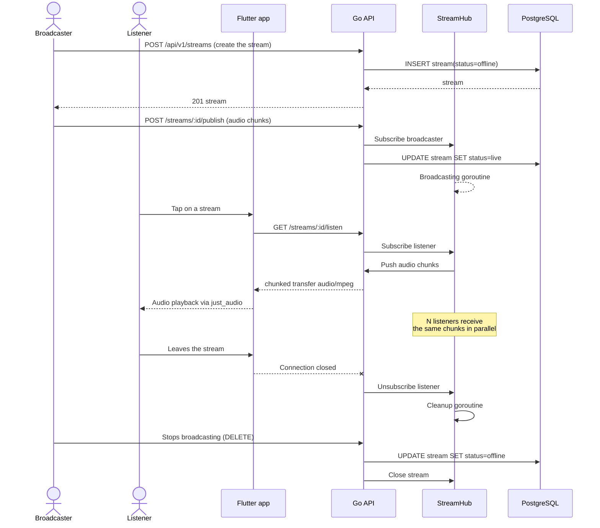

### 9.5 Deployment diagram

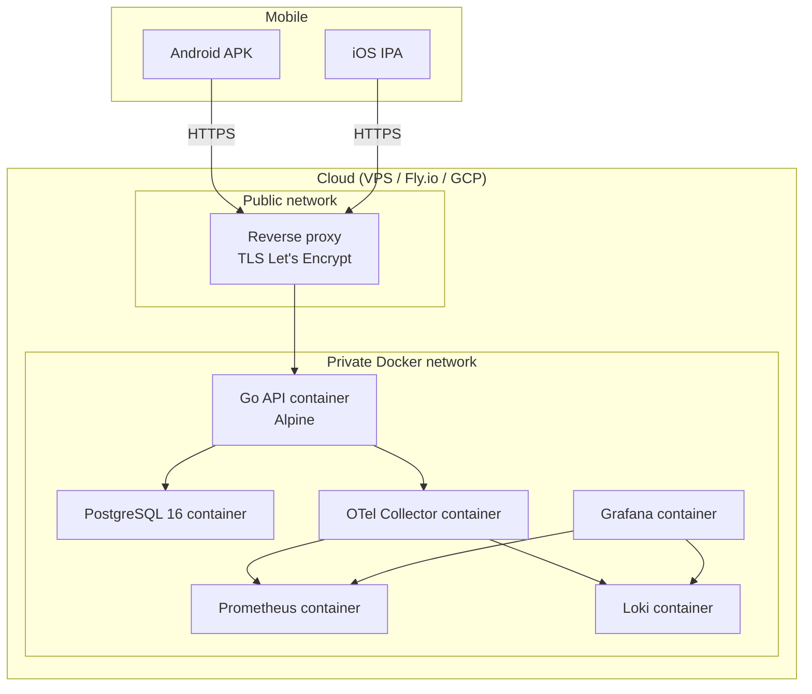

---

## 10. BPMN diagrams

> The BPMN diagrams below are written using a Mermaid notation compatible with the BPMN principles. A strict BPMN 2.0 export will be made available in `docs/diagrams/`.

### 10.1 Registration process

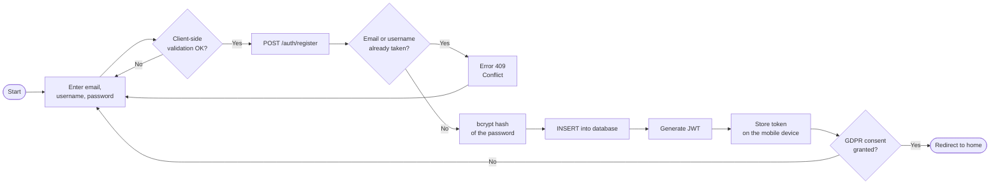

### 10.2 Stream broadcasting process

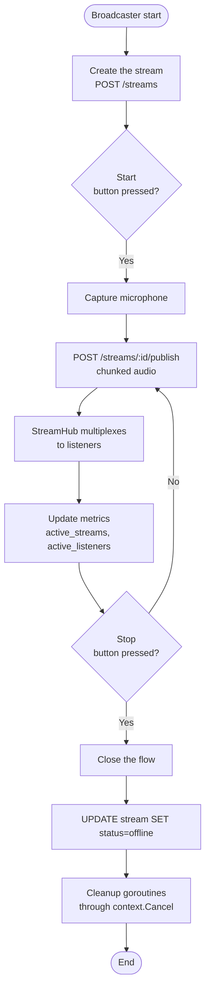

### 10.3 CI/CD process

```mermaid
flowchart LR
    DEV[Developer] --> COMMIT[git commit signed]
    COMMIT --> PUSH[git push]
    PUSH --> PR{Pull Request?}
    PR -->|Yes| CI[GitHub Actions CI]
    CI --> LINT[go vet + golangci-lint<br/>flutter analyze]
    LINT --> TEST[Unit tests + race<br/>+ coverage 80%]
    TEST --> SEC[govulncheck + trivy + gitleaks]
    SEC --> OK{All steps<br/>green?}
    OK -->|No| NOTIFY[Team notification<br/>CI failure]
    NOTIFY --> DEV
    OK -->|Yes| REVIEW[Mandatory code review]
    REVIEW --> MERGE[Merge into main]
    MERGE --> BUILD[Build Docker image]
    BUILD --> PUSHREG[Push to GHCR]
    PUSHREG --> DEPLOY[Automated deployment]
    DEPLOY --> VERIFY[Healthcheck /health]
    VERIFY --> PROD([Production])
```

### 10.4 Incident management process

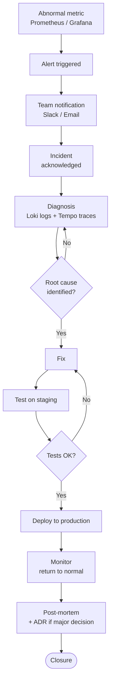

---

## 11. Non-functional requirements

| Category | Requirement | Target | Measurement |
|---|---|---|---|
| **Performance** | Audio streaming latency | < 2 s between broadcaster and listener | End-to-end manual check + metrics |
| **Performance** | API latency (p95) | < 200 ms outside streaming | Prometheus `http_request_duration` |
| **Load** | Simultaneous listeners per stream | ≥ 100 on a 2 vCPU / 2 GB VPS | Load tests with k6 |
| **UI performance** | Mobile fluidity | Sustained 60 FPS | Flutter DevTools |
| **Availability** | Production uptime | 99% | Prometheus metrics |
| **Security** | SSL Labs grade | ≥ A | Public SSL Labs test |
| **Tests** | Backend coverage | ≥ 80% | `go test -coverprofile` |
| **Docker image** | API image size | < 30 MB | `docker image inspect` |
| **Accessibility** | Lighthouse score on documentation | ≥ 80 | Lighthouse audit |
| **Mobile accessibility** | TalkBack / VoiceOver compliance | Full navigation | Manual testing |
| **Internationalization** | Documentation | FR + EN, B2 level | Bilingual specifications |

---

## 12. Constraints and limitations

### 12.1 Imposed technical constraints

- **Backend mandatory in Go** (course taught by Thomas Guillier).
- **Mobile frontend mandatory in Flutter** (course taught by Thomas Coichot).
- **Native OpenTelemetry observability** (Block 3 requirement).
- **12-Factor configuration** (no hardcoding).
- **Multi-stage Docker image** based on Alpine or distroless.

### 12.2 Academic constraints

- GitHub repository with **GPG-signed commits**.
- Bilingual documentation **FR/EN** (at least B2 level).
- **Public production deployment** (URL accessible to the jury).
- **Final archive**: code + documentation + deliverables.
- 20-minute individual defense per student.

### 12.3 Known functional limitations (v1.0.0)

- No monetization, no payment system.
- No on-the-fly transcoding (single audio quality in v1).
- No WebRTC: streaming relies on HTTP chunked transfer.
- No live chat (planned as a bonus feature).
- No full offline mode (playlist caching planned as a bonus).
- No Web / TV mobile support; the scope is limited to iOS and Android.

### 12.4 Assumptions and external dependencies

- The broadcaster has a stable network connection of at least 256 kbps upload.
- The target cloud environment provides a valid TLS certificate (Let's Encrypt).
- The development workstation has Docker, Go ≥ 1.22 and Flutter ≥ 3.22 installed.

---

## 13. Appendices

### 13.1 Related documents

| Document | Location |
|---|---|
| Project tickets (RNCP mapping) | [`docs/TICKETS.md`](./TICKETS.md) |
| ADRs (upcoming) | `docs/adr/` |
| Test plan (upcoming) | `docs/PLAN_DE_TESTS.md` |
| GDPR register (upcoming) | `docs/RGPD.md` |
| Git strategy (upcoming) | `docs/GIT_STRATEGY.md` |
| User training plan (upcoming) | `docs/PLAN_FORMATION.md` |
| Toolchain (upcoming) | `docs/TOOLCHAIN.md` |
| Swagger API documentation | `/swagger/` (to be exposed) |

### 13.2 Main API endpoints (summary)

| Method | Path | Required role | Description |
|---|---|---|---|
| POST | `/api/v1/auth/register` | Anonymous | Account creation |
| POST | `/api/v1/auth/login` | Anonymous | Sign in (returns a JWT) |
| GET | `/api/v1/users/me` | User+ | Current profile |
| PUT | `/api/v1/users/me` | User+ | Update profile |
| DELETE | `/api/v1/users/me` | User+ | Account deletion (GDPR) |
| GET | `/api/v1/users/me/data` | User+ | Data export (GDPR) |
| GET | `/api/v1/streams` | Anonymous | List streams |
| POST | `/api/v1/streams` | Broadcaster+ | Create a stream |
| GET | `/api/v1/streams/:id/listen` | Anonymous | Listen to a stream |
| POST | `/api/v1/streams/:id/publish` | Broadcaster+ | Publish the audio flow |
| GET | `/api/v1/playlists` | User+ | List playlists |
| POST | `/api/v1/playlists` | User+ | Create a playlist |
| GET | `/api/v1/admin/users` | Admin | List users |
| PUT | `/api/v1/admin/users/:id/role` | Admin | Update role |
| GET | `/health` | Anonymous | Healthcheck |
| GET | `/metrics` | Internal | Prometheus metrics |

### 13.3 Environment variables

| Variable | Required | Default | Description |
|---|:---:|---|---|
| `PORT` | No | `8080` | HTTP listening port |
| `DATABASE_URL` | Yes | — | PostgreSQL DSN |
| `JWT_SECRET` | Yes | — | JWT signing secret (≥ 32 characters) |
| `OTEL_ENDPOINT` | No | `localhost:4317` | OTel Collector endpoint (OTLP gRPC) |
| `LOG_LEVEL` | No | `info` | `debug`, `info`, `warn`, `error` |
| `ENVIRONMENT` | No | `development` | `development`, `staging`, `production` |
| `CORS_ORIGINS` | No | `*` | Allowed origins (comma-separated) |

### 13.4 Document version history

| Version | Date | Author(s) | Notes |
|---|---|---|---|
| 1.0.0 | 2026-06-01 | StreamPulse team | Initial release, aligned with solution v1.0.0. |

---

*End of technical specifications — English version.*
