# Cahier des charges — StreamPulse

| | |
|---|---|
| **Projet** | StreamPulse — Plateforme de streaming audio en temps réel |
| **Version du document** | 1.0.0 |
| **Version de la solution décrite** | v1.0.0 |
| **Cadre académique** | École .decode — 5A Tech Lead, S2 Bloc 3 (RNCP 38822) |
| **Année** | 2025–2026 |
| **Langue** | Français (version anglaise : [`cahier-des-charges-en.md`](./cahier-des-charges-en.md)) |

> Ce document décrit l'intégralité des spécifications fonctionnelles, techniques, de sécurité et d'architecture de la solution **StreamPulse**. Il sert de référence contractuelle entre l'équipe projet et le jury RNCP.

---

## Sommaire

1. [Contexte et objectifs](#1-contexte-et-objectifs)
2. [Glossaire](#2-glossaire)
3. [Périmètre fonctionnel et acteurs](#3-périmètre-fonctionnel-et-acteurs)
4. [User Stories](#4-user-stories)
5. [Spécifications techniques](#5-spécifications-techniques)
6. [Architecture globale](#6-architecture-globale)
7. [Modèle de données et schéma BDD](#7-modèle-de-données-et-schéma-bdd)
8. [Schéma général de sécurité](#8-schéma-général-de-sécurité)
9. [Diagrammes UML](#9-diagrammes-uml)
10. [Diagrammes BPMN](#10-diagrammes-bpmn)
11. [Exigences non fonctionnelles](#11-exigences-non-fonctionnelles)
12. [Contraintes et limites](#12-contraintes-et-limites)
13. [Annexes](#13-annexes)

---

## 1. Contexte et objectifs

### 1.1 Contexte métier

L'industrie du streaming et de la diffusion de contenus en direct connaît une croissance soutenue. Les usages couvrent les radios numériques, les podcasts en direct, les sessions de DJ en ligne, et le monitoring audio industriel. Tous ces domaines exigent une infrastructure capable de gérer des flux massifs avec une latence minimale et une haute disponibilité.

### 1.2 Problématique adressée

> *Comment concevoir une plateforme de diffusion audio en temps réel capable de servir N auditeurs simultanés à partir d'une source unique, tout en garantissant l'observabilité, la résilience et la conformité réglementaire attendues d'un produit en production ?*

### 1.3 Objectifs du projet

| Objectif | Description |
|---|---|
| **O1 — Streaming temps réel** | Diffuser un flux audio d'un *broadcaster* vers N *listeners* avec une latence faible. |
| **O2 — Multi-rôles** | Gérer quatre profils (anonyme, utilisateur, diffuseur, administrateur) avec des droits distincts. |
| **O3 — Observabilité** | Fournir une visibilité complète via traces (OpenTelemetry), métriques (Prometheus) et logs (Loki). |
| **O4 — Industrialisation** | Conteneuriser, automatiser la CI/CD, externaliser la configuration (12-Factor App). |
| **O5 — Mobile multi-plateforme** | Délivrer une application Flutter fonctionnant sur iOS et Android. |
| **O6 — Conformité** | Respecter le RGPD, sécuriser les communications (TLS), suivre les bonnes pratiques OWASP. |

### 1.4 Périmètre du Bloc 3 RNCP 38822

Ce projet répond à la compétence *« Piloter la mise en production des solutions logicielles et leur évolution »*. Six activités sont couvertes :

- **A3.1** — Intégration des changements de code (CI, contrôle de version)
- **A3.2** — Tests automatisés
- **A3.3** — Surveillance continue des mises à jour
- **A3.4** — Distribution automatique (CD)
- **A3.5** — Opérations continues du cycle de vie DevOps
- **A3.6** — Élaboration de la documentation technique

---

## 2. Glossaire

| Terme | Définition |
|---|---|
| **Broadcaster** | Utilisateur autorisé à diffuser un flux audio en direct. |
| **Listener** | Utilisateur (anonyme ou authentifié) qui consomme un flux audio. |
| **Stream** | Flux audio diffusé en direct par un broadcaster. |
| **Track** | Fichier audio enregistré, pouvant être inclus dans une playlist. |
| **Playlist** | Liste ordonnée de tracks appartenant à un utilisateur. |
| **Hub** | Composant logiciel qui multiplexe un flux source vers plusieurs abonnés via un patron pub/sub. |
| **JWT** | JSON Web Token, utilisé pour l'authentification stateless. |
| **OTEL** | OpenTelemetry, standard d'instrumentation pour traces, métriques et logs. |
| **12-Factor App** | Méthodologie de conception d'applications cloud-native. |
| **ADR** | Architecture Decision Record, document justifiant un choix technique. |
| **BLoC** | Business Logic Component, patron de gestion d'état utilisé en Flutter. |
| **DDD** | Domain-Driven Design, approche de conception centrée sur le domaine métier. |
| **SRE** | Site Reliability Engineering, discipline d'ingénierie de la fiabilité. |
| **RNCP** | Répertoire National des Certifications Professionnelles. |
| **RGPD** | Règlement Général sur la Protection des Données. |

---

## 3. Périmètre fonctionnel et acteurs

### 3.1 Acteurs du système

| Acteur | Rôle technique | Description |
|---|---|---|
| **Anonyme** | `anonymous` | Visiteur non authentifié. Peut consulter la liste publique des streams et écouter sans favoris. |
| **Utilisateur** | `user` | Compte créé. Peut écouter, gérer ses favoris, créer et organiser des playlists. |
| **Diffuseur** | `broadcaster` | Utilisateur étendu. Peut créer des streams live, téléverser des fichiers audio. |
| **Administrateur** | `admin` | Gère les utilisateurs, accède aux métriques globales, modère le contenu. |

### 3.2 Matrice des capacités

| Capacité | Anonyme | User | Broadcaster | Admin |
|---|:---:|:---:|:---:|:---:|
| Écouter un stream public | ✅ | ✅ | ✅ | ✅ |
| S'inscrire / Se connecter | ✅ | — | — | — |
| Marquer un stream en favori | ❌ | ✅ | ✅ | ✅ |
| Créer une playlist | ❌ | ✅ | ✅ | ✅ |
| Créer un stream live | ❌ | ❌ | ✅ | ✅ |
| Uploader un fichier audio | ❌ | ❌ | ✅ | ✅ |
| Gérer les utilisateurs | ❌ | ❌ | ❌ | ✅ |
| Accéder aux métriques globales | ❌ | ❌ | ❌ | ✅ |

---

## 4. User Stories

> Chaque user story suit le format *« En tant que [rôle], je veux [action] afin de [bénéfice] »* et porte un identifiant `US-XXX` réutilisé dans le cahier de recette et les tests fonctionnels.

### 4.1 Authentification et profil

- **US-001** — En tant qu'**anonyme**, je veux m'inscrire avec un email, un nom d'utilisateur et un mot de passe afin de créer un compte personnel.
  - *Critères* : email unique, mot de passe ≥ 8 caractères, retour d'un JWT en cas de succès, code HTTP 409 si doublon.
- **US-002** — En tant qu'**utilisateur**, je veux me connecter avec mes identifiants afin d'accéder à mon espace personnel.
  - *Critères* : JWT retourné, expiration configurable, code 401 si invalide.
- **US-003** — En tant qu'**utilisateur**, je veux consulter et modifier mon profil afin de tenir mes informations à jour.
- **US-004** — En tant qu'**utilisateur**, je veux supprimer mon compte afin d'exercer mon droit à l'oubli (RGPD).
- **US-005** — En tant qu'**utilisateur**, je veux exporter mes données personnelles afin d'exercer mon droit d'accès (RGPD).

### 4.2 Écoute et découverte

- **US-010** — En tant qu'**auditeur**, je veux parcourir la liste des streams live afin de trouver du contenu à écouter.
- **US-011** — En tant qu'**auditeur**, je veux écouter un stream en direct afin de profiter d'un flux audio en temps réel.
- **US-012** — En tant qu'**auditeur**, je veux contrôler la lecture (play, pause, volume) afin de personnaliser mon écoute.
- **US-013** — En tant qu'**auditeur**, je veux que la lecture continue en arrière-plan afin de pouvoir utiliser d'autres applications en parallèle.

### 4.3 Playlists et tracks

- **US-020** — En tant qu'**utilisateur**, je veux créer une playlist afin d'organiser mes morceaux favoris.
- **US-021** — En tant qu'**utilisateur**, je veux ajouter ou retirer un track d'une playlist afin de la mettre à jour.
- **US-022** — En tant qu'**utilisateur**, je veux réorganiser les tracks d'une playlist afin de définir un ordre de lecture.
- **US-023** — En tant qu'**utilisateur**, je veux lire une playlist en continu afin d'écouter plusieurs morceaux sans intervention.

### 4.4 Diffusion (Broadcaster)

- **US-030** — En tant que **broadcaster**, je veux créer un stream afin d'annoncer une session de diffusion à venir.
- **US-031** — En tant que **broadcaster**, je veux démarrer la diffusion audio depuis mon appareil afin de diffuser en direct.
- **US-032** — En tant que **broadcaster**, je veux arrêter la diffusion à tout moment afin de terminer la session.
- **US-033** — En tant que **broadcaster**, je veux voir le nombre d'auditeurs en temps réel afin d'évaluer mon audience.
- **US-034** — En tant que **broadcaster**, je veux téléverser un fichier audio afin d'enrichir le catalogue de tracks.

### 4.5 Administration

- **US-040** — En tant qu'**admin**, je veux lister tous les utilisateurs afin d'avoir une vue d'ensemble.
- **US-041** — En tant qu'**admin**, je veux modifier le rôle d'un utilisateur afin d'accorder ou retirer des privilèges.
- **US-042** — En tant qu'**admin**, je veux désactiver un compte afin de répondre à un signalement.
- **US-043** — En tant qu'**admin**, je veux consulter le dashboard global afin de surveiller la santé du système.
- **US-044** — En tant qu'**admin**, je veux consulter les feedbacks utilisateurs afin d'orienter la feuille de route.

### 4.6 Transverse

- **US-050** — En tant qu'**utilisateur**, je veux soumettre un feedback afin de signaler un problème ou suggérer une amélioration.
- **US-051** — En tant qu'**utilisateur en situation de handicap**, je veux naviguer dans l'application avec un lecteur d'écran afin d'accéder au service de façon autonome.

---

## 5. Spécifications techniques

### 5.1 Stack technologique

#### Backend

| Couche | Technologie | Version | Justification |
|---|---|---|---|
| Langage | Go | 1.22+ | Performance, concurrence native via goroutines. |
| Framework HTTP | Gin | v1.10 | Léger, mature, écosystème de middlewares. |
| ORM | GORM | v1.25 | Standard de l'écosystème Go, support PostgreSQL natif. |
| Base de données | PostgreSQL | 16 | Relationnel, robuste, support JSONB. |
| Authentification | JWT (`golang-jwt/jwt`) | v5 | Sans état, scalable. |
| Hash mot de passe | `bcrypt` | — | Standard industrie, résistant aux attaques par force brute. |
| Configuration | Viper | v1.18 | Support .env, env vars, hiérarchie. |
| Logs | `log/slog` (stdlib) | Go 1.22+ | JSON natif, performant. |
| Traces | OpenTelemetry Go SDK | v1.24 | Standard CNCF. |
| Métriques | `prometheus/client_golang` | v1.19 | Standard du marché. |

#### Frontend mobile

| Couche | Technologie | Version | Justification |
|---|---|---|---|
| Framework | Flutter | 3.22+ | Multi-plateforme iOS/Android avec une seule base de code. |
| Langage | Dart | 3.4+ | Null safety, performance. |
| State management | flutter_bloc | v8 | Patron explicite, prévisible, testable. |
| Routage | go_router | v14 | Routage déclaratif, deep linking. |
| Audio | just_audio + audio_service | v0.9 / v0.18 | Streaming HTTP + lecture en arrière-plan. |
| HTTP | Dio | v5 | Intercepteurs JWT, retry, timeouts. |
| Stockage sécurisé | flutter_secure_storage | v9 | Keychain iOS / Keystore Android. |

#### Infrastructure et observabilité

| Composant | Outil |
|---|---|
| Conteneurisation | Docker (multi-stage, image finale Alpine) |
| Orchestration locale | Docker Compose |
| Métriques | Prometheus |
| Visualisation | Grafana |
| Logs centralisés | Loki |
| Collecteur de télémétrie | OpenTelemetry Collector |
| Traces | Tempo (ou Jaeger) |
| CI/CD | GitHub Actions |

### 5.2 Méthodologie 12-Factor App

L'application respecte la totalité des douze facteurs, notamment :

- **III. Config** — toutes les valeurs sensibles ou environnement-dépendantes sont injectées via variables d'environnement (`DATABASE_URL`, `JWT_SECRET`, `OTEL_ENDPOINT`, etc.). Le fichier `.env.example` documente l'ensemble des variables.
- **IV. Backing services** — la base PostgreSQL et le collecteur OTEL sont consommés comme des ressources interchangeables via leur URL.
- **VI. Processes** — l'API Go est sans état (stateless) ; toute donnée persistante passe par PostgreSQL.
- **XI. Logs** — les logs sont émis sur `stdout` au format JSON et agrégés par Loki.

### 5.3 Conventions de code

- Go : `go fmt`, `go vet`, `golangci-lint`, tests « table-driven » avec `testify`.
- Dart/Flutter : `flutter analyze`, conventions effective_dart, tests `bloc_test` et `flutter_test`.
- Commits : **Conventional Commits** (`feat:`, `fix:`, `docs:`, `ci:`, ...), commits signés GPG.

---

## 6. Architecture globale

### 6.1 Vue d'ensemble (C4 — Niveau Conteneurs)

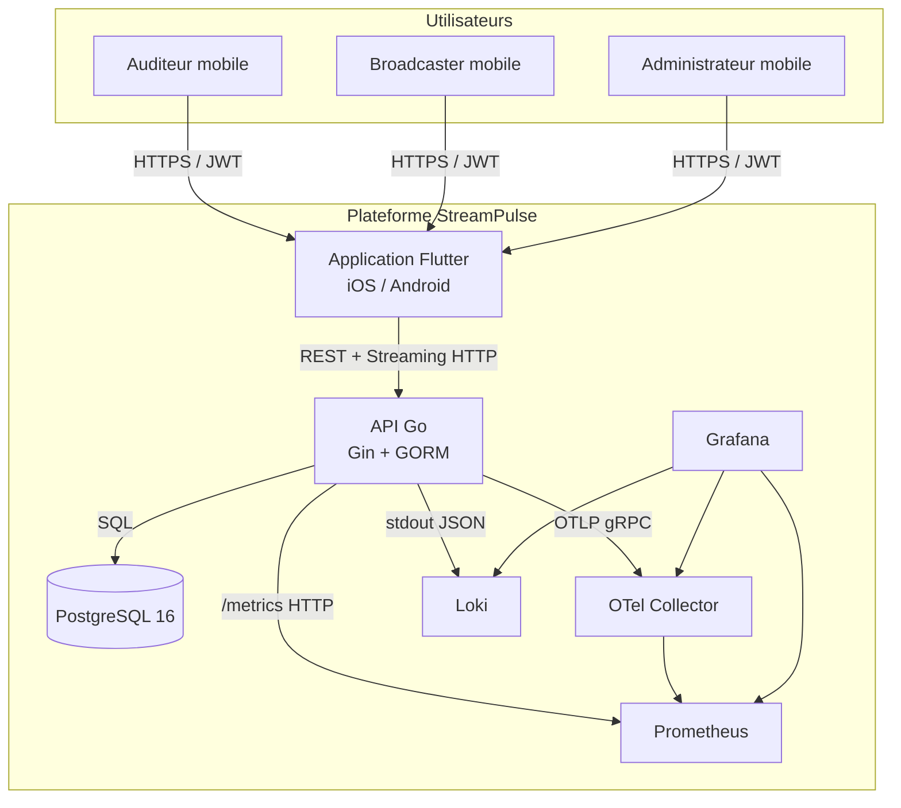

### 6.2 Architecture interne du backend (Clean Architecture / DDD)

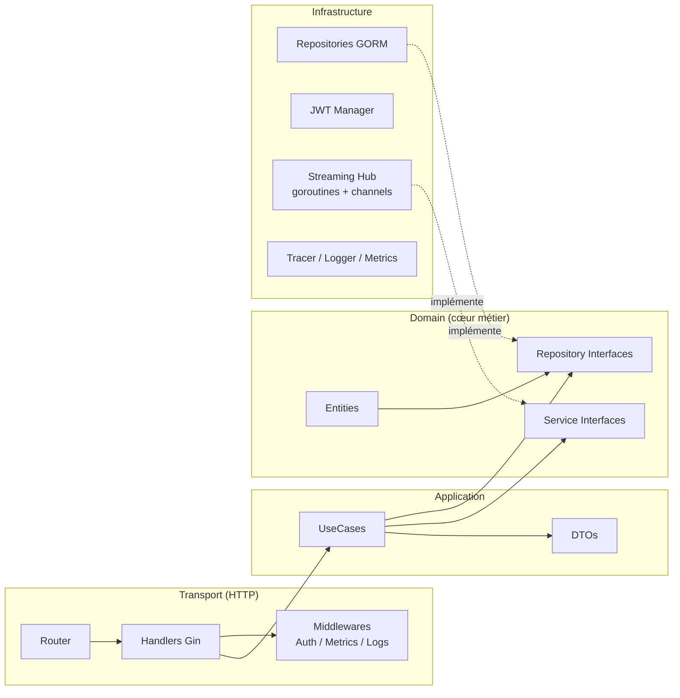

**Règle de dépendance** : `domain` n'a aucune dépendance externe ; `application` dépend uniquement du `domain` ; `infrastructure` et `transport` dépendent du `domain` et de l'`application`.

### 6.3 Architecture du frontend (Feature-based + BLoC)

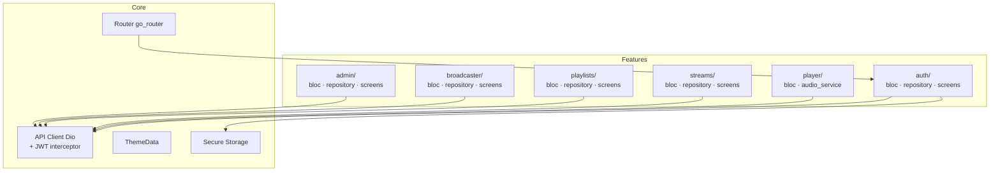

---

## 7. Modèle de données et schéma BDD

### 7.1 Diagramme entité-relation (ERD)

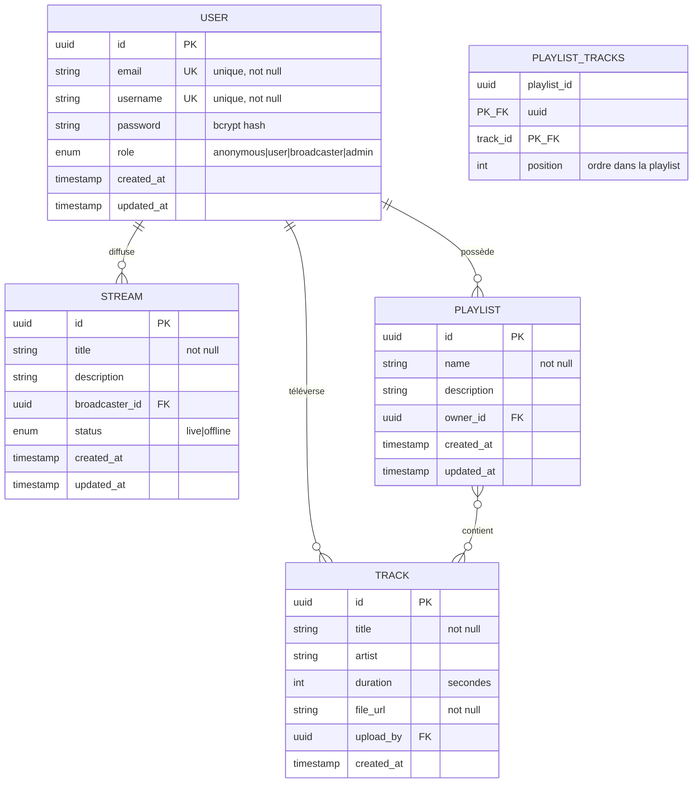

### 7.2 Description des tables

| Table | Description | Index notables |
|---|---|---|
| `users` | Comptes utilisateurs et rôles. | `email` UNIQUE, `username` UNIQUE |
| `streams` | Sessions de diffusion live. | `broadcaster_id`, `status` |
| `playlists` | Listes de tracks par utilisateur. | `owner_id` |
| `tracks` | Métadonnées des fichiers audio. | `upload_by` |
| `playlist_tracks` | Table d'association many-to-many. | `(playlist_id, track_id)` |
| `feedbacks` *(prévu)* | Retours utilisateurs (note, commentaire). | `user_id` |

### 7.3 Contraintes d'intégrité

- Suppression d'un utilisateur → suppression en cascade de ses streams, playlists et tracks (droit à l'oubli RGPD).
- Tous les identifiants sont des UUID v4 générés en base via `gen_random_uuid()`.
- Toutes les requêtes passent par GORM, qui paramètre automatiquement les requêtes SQL (protection contre l'injection).

---

## 8. Schéma général de sécurité

### 8.1 Vue d'ensemble

```mermaid
graph TB
    CLIENT[Client mobile Flutter]
    LB[Reverse proxy / TLS<br/>Let's Encrypt]
    API[API Go]
    DB[(PostgreSQL)]

    CLIENT -->|HTTPS TLS 1.2+| LB
    LB -->|HTTP interne| API
    API -->|TLS<br/>credentials chiffrés| DB

    subgraph "Mesures de sécurité API"
        M1[JWT Bearer obligatoire<br/>routes protégées]
        M2[Rate limiting<br/>/auth/*]
        M3[Headers sécurité<br/>X-Frame-Options, CSP]
        M4[Validation des inputs]
        M5[CORS strict en prod]
        M6[/metrics protégé]
    end

    API --- M1
    API --- M2
    API --- M3
    API --- M4
    API --- M5
    API --- M6
```

### 8.2 Authentification et autorisation

- **Mots de passe** : hashés avec `bcrypt` (coût 12 minimum), jamais retournés par l'API (`json:"-"`).
- **JWT** : signature HMAC-SHA256, secret de ≥ 32 caractères injecté via `JWT_SECRET`, durée de vie configurable (24 h par défaut).
- **Claims** : `sub` (user_id), `role`, `iat`, `exp`.
- **Middleware** : `AuthMiddleware` extrait et valide le token ; `RequireRole(role...)` vérifie le rôle.

### 8.3 Protection des communications

- TLS 1.2 minimum, terminaison TLS par reverse-proxy (Traefik/Caddy/Nginx).
- Redirection HTTP → HTTPS forcée en production.
- Objectif : score SSL Labs ≥ A.

### 8.4 Protection des données

| Donnée | Protection |
|---|---|
| Mot de passe | Hash bcrypt, jamais en clair |
| JWT côté mobile | `flutter_secure_storage` (Keychain / Keystore) |
| Email dans les logs | Anonymisé / masqué |
| Adresse IP | Hashée avant journalisation |
| Données utilisateur | Chiffrement TLS en transit |

### 8.5 Conformité RGPD

- **Consentement explicite** à l'inscription.
- **Droit d'accès** : endpoint `GET /api/v1/users/me/data` (export JSON).
- **Droit à l'oubli** : endpoint `DELETE /api/v1/users/me` (suppression complète en cascade).
- **Registre des traitements** : `docs/RGPD.md`.
- **Durée de rétention** : 3 ans après dernière activité, puis suppression automatique.

### 8.6 Sécurité de la chaîne CI/CD

- Scan des dépendances Go : `govulncheck` à chaque PR.
- Scan d'image Docker : `trivy` à chaque build.
- Audit des secrets : `gitleaks` dans la CI.
- Dependabot activé sur le dépôt GitHub.

---

## 9. Diagrammes UML

### 9.1 Diagramme de classes (domaine)

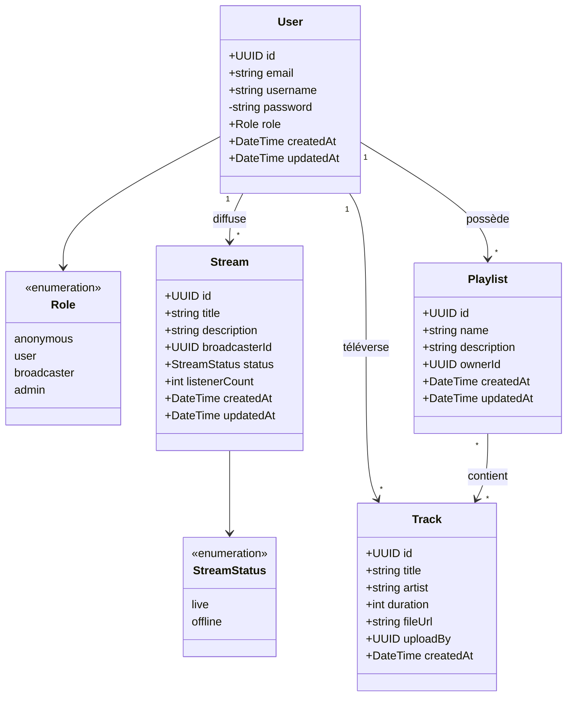

### 9.2 Diagramme de cas d'utilisation

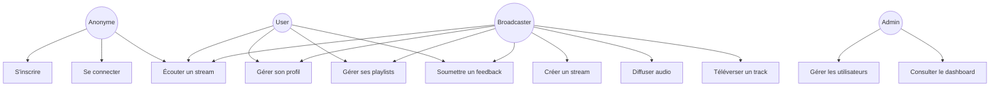

### 9.3 Diagramme de séquence — Inscription puis connexion

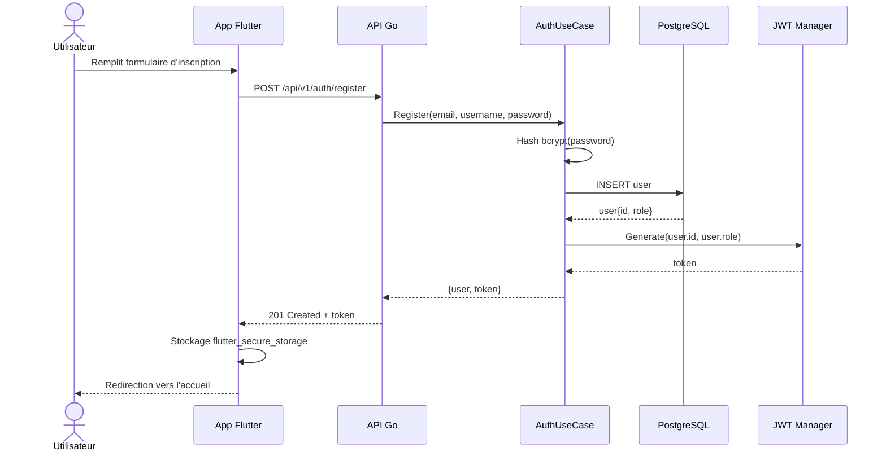

### 9.4 Diagramme de séquence — Diffusion d'un flux audio

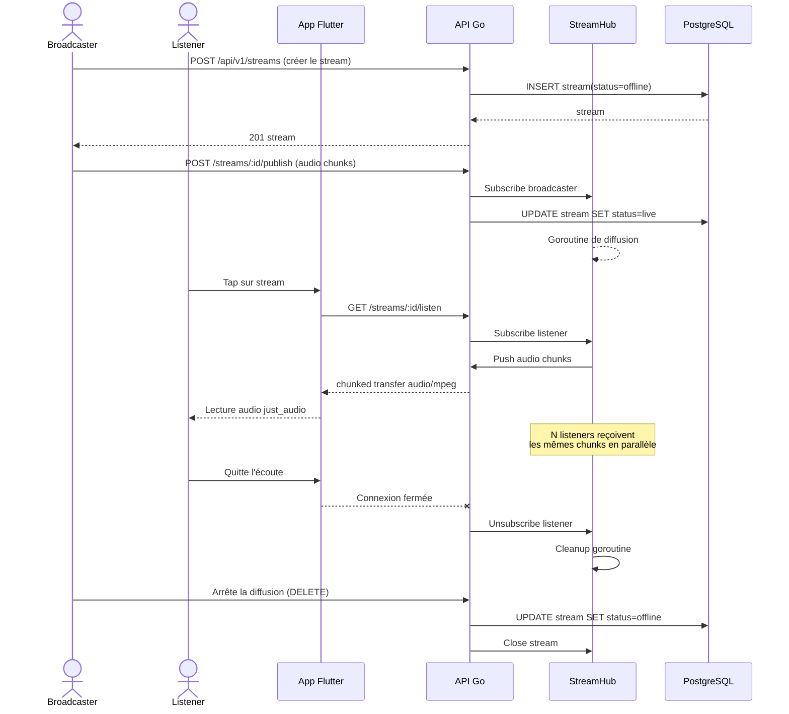

### 9.5 Diagramme de déploiement

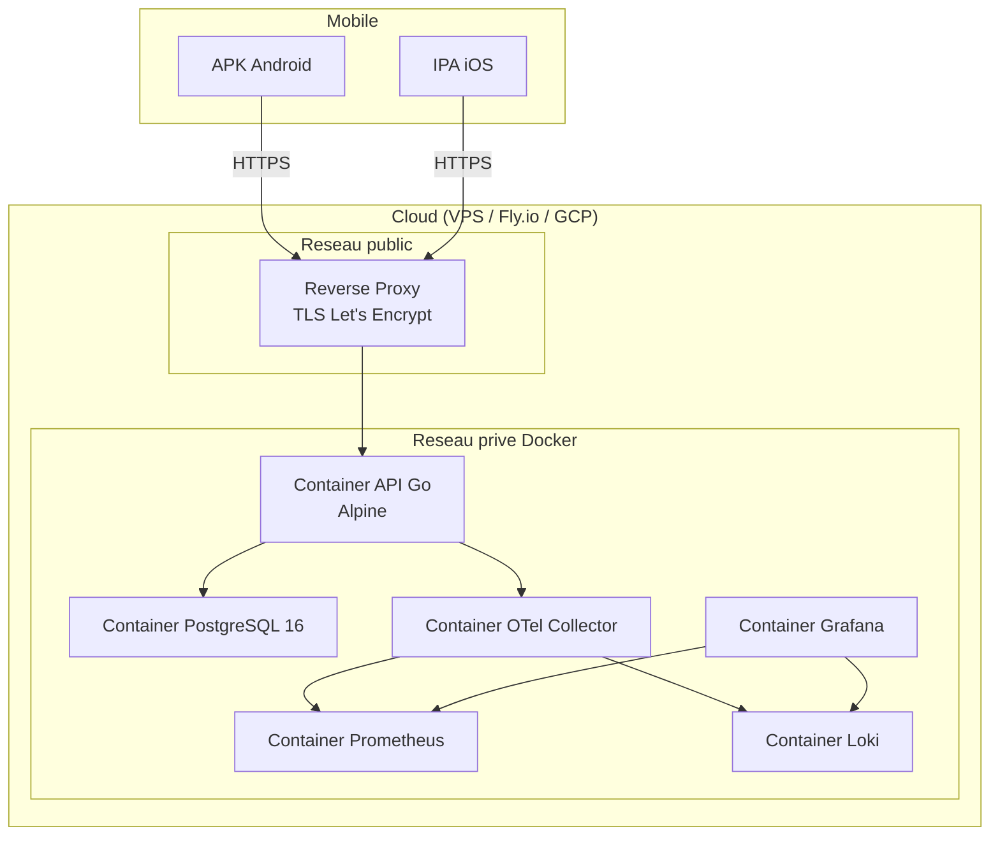

---

## 10. Diagrammes BPMN

> Les diagrammes BPMN ci-dessous sont représentés en notation Mermaid compatible. Un export en notation BPMN 2.0 stricte est disponible dans `docs/diagrams/`.

### 10.1 Processus d'inscription

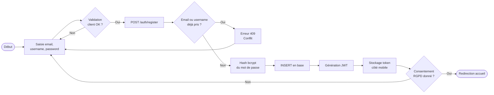

### 10.2 Processus de diffusion d'un stream

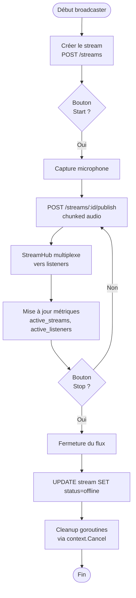

### 10.3 Processus CI/CD

```mermaid
flowchart LR
    DEV[Développeur] --> COMMIT[git commit signé]
    COMMIT --> PUSH[git push]
    PUSH --> PR{Pull Request ?}
    PR -->|Oui| CI[GitHub Actions CI]
    CI --> LINT[go vet + golangci-lint<br/>flutter analyze]
    LINT --> TEST[Tests unitaires + race<br/>+ coverage 80%]
    TEST --> SEC[govulncheck + trivy + gitleaks]
    SEC --> OK{Toutes étapes<br/>OK ?}
    OK -->|Non| NOTIFY[Notification équipe<br/>échec CI]
    NOTIFY --> DEV
    OK -->|Oui| REVIEW[Code review obligatoire]
    REVIEW --> MERGE[Merge sur main]
    MERGE --> BUILD[Build image Docker]
    BUILD --> PUSHREG[Push sur GHCR]
    PUSHREG --> DEPLOY[Déploiement auto]
    DEPLOY --> VERIFY[Healthcheck /health]
    VERIFY --> PROD([Production])
```

### 10.4 Processus de gestion des incidents

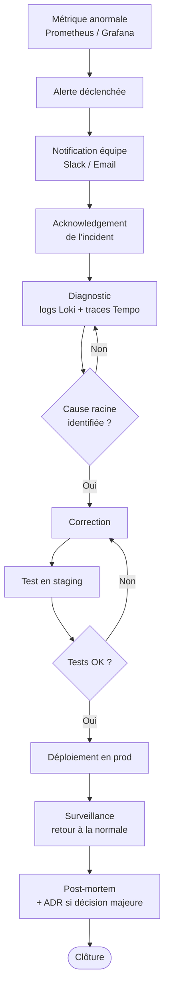

---

## 11. Exigences non fonctionnelles

| Catégorie | Exigence | Cible | Mesure |
|---|---|---|---|
| **Performance** | Latence streaming audio | < 2 s entre broadcaster et listener | Mesure end-to-end manuelle + métriques |
| **Performance** | Latence API (p95) | < 200 ms hors streaming | `http_request_duration` Prometheus |
| **Charge** | Listeners simultanés par stream | ≥ 100 sur un VPS 2 vCPU / 2 Go | Tests de charge k6 |
| **Performance UI** | Fluidité mobile | 60 FPS soutenus | Flutter DevTools |
| **Disponibilité** | Uptime cible | 99 % en production | Métriques Prometheus |
| **Sécurité** | Score SSL Labs | ≥ A | Test public SSL Labs |
| **Tests** | Couverture backend | ≥ 80 % | `go test -coverprofile` |
| **Image Docker** | Taille image API | < 30 Mo | `docker image inspect` |
| **Accessibilité** | Lighthouse doc web | ≥ 80 | Audit Lighthouse |
| **Accessibilité mobile** | Conformité TalkBack/VoiceOver | Navigation complète | Tests manuels |
| **Internationalisation** | Documentation | FR + EN niveau B2 | Cahier des charges bilingue |

---

## 12. Contraintes et limites

### 12.1 Contraintes techniques imposées

- **Backend obligatoire en Go** (cours Thomas Guillier).
- **Frontend mobile obligatoire en Flutter** (cours Thomas Coichot).
- **Observabilité native OpenTelemetry** (exigence Bloc 3).
- **Configuration 12-Factor** (zéro hardcoding).
- **Image Docker multi-stage** alpine/distroless.

### 12.2 Contraintes pédagogiques

- Repository GitHub avec commits **signés GPG**.
- Documentation bilingue **FR/EN** (niveau B2 minimum).
- **Mise en production** publique (URL accessible au jury).
- **Archive finale** : code + documentation + livrables.
- Soutenance individuelle de 20 minutes par étudiant.

### 12.3 Limites fonctionnelles connues (v1.0.0)

- Pas de monétisation, pas de système de paiement.
- Pas de transcodage audio (qualité unique en v1).
- Pas de WebRTC : le streaming utilise HTTP chunked transfer.
- Pas de chat live (prévu en bonus).
- Pas de mode offline complet (cache de playlists prévu en bonus).
- Pas de support Web mobile / TV ; le périmètre est iOS + Android.

### 12.4 Hypothèses et dépendances externes

- Le broadcaster dispose d'une connexion réseau stable d'au moins 256 kbps en upload.
- L'environnement cloud cible fournit un certificat TLS valide (Let's Encrypt).
- Le poste de développement dispose de Docker, Go ≥ 1.22, Flutter ≥ 3.22.

---

## 13. Annexes

### 13.1 Documents associés

| Document | Localisation |
|---|---|
| Tickets projet (RNCP mapping) | [`docs/TICKETS.md`](./TICKETS.md) |
| ADR (à venir) | `docs/adr/` |
| Plan de tests (à venir) | `docs/PLAN_DE_TESTS.md` |
| Registre RGPD (à venir) | `docs/RGPD.md` |
| Stratégie Git (à venir) | `docs/GIT_STRATEGY.md` |
| Plan de formation (à venir) | `docs/PLAN_FORMATION.md` |
| Toolchain (à venir) | `docs/TOOLCHAIN.md` |
| Documentation API Swagger | `/swagger/` (à exposer) |

### 13.2 Endpoints principaux de l'API (résumé)

| Méthode | Chemin | Rôle requis | Description |
|---|---|---|---|
| POST | `/api/v1/auth/register` | Anonyme | Création de compte |
| POST | `/api/v1/auth/login` | Anonyme | Connexion (retourne JWT) |
| GET | `/api/v1/users/me` | User+ | Profil courant |
| PUT | `/api/v1/users/me` | User+ | Mise à jour profil |
| DELETE | `/api/v1/users/me` | User+ | Suppression compte (RGPD) |
| GET | `/api/v1/users/me/data` | User+ | Export données (RGPD) |
| GET | `/api/v1/streams` | Anonyme | Liste des streams |
| POST | `/api/v1/streams` | Broadcaster+ | Créer un stream |
| GET | `/api/v1/streams/:id/listen` | Anonyme | Écouter un stream |
| POST | `/api/v1/streams/:id/publish` | Broadcaster+ | Diffuser le flux |
| GET | `/api/v1/playlists` | User+ | Liste des playlists |
| POST | `/api/v1/playlists` | User+ | Créer une playlist |
| GET | `/api/v1/admin/users` | Admin | Liste des utilisateurs |
| PUT | `/api/v1/admin/users/:id/role` | Admin | Modifier rôle |
| GET | `/health` | Anonyme | Healthcheck |
| GET | `/metrics` | Interne | Métriques Prometheus |

### 13.3 Variables d'environnement

| Variable | Obligatoire | Défaut | Description |
|---|:---:|---|---|
| `PORT` | Non | `8080` | Port d'écoute HTTP |
| `DATABASE_URL` | Oui | — | DSN PostgreSQL |
| `JWT_SECRET` | Oui | — | Secret de signature JWT (≥ 32 caractères) |
| `OTEL_ENDPOINT` | Non | `localhost:4317` | Endpoint OTel Collector (OTLP gRPC) |
| `LOG_LEVEL` | Non | `info` | `debug`, `info`, `warn`, `error` |
| `ENVIRONMENT` | Non | `development` | `development`, `staging`, `production` |
| `CORS_ORIGINS` | Non | `*` | Origines autorisées (CSV) |

### 13.4 Historique des versions du document

| Version | Date | Auteur(s) | Notes |
|---|---|---|---|
| 1.0.0 | 2026-06-01 | Équipe StreamPulse | Version initiale, alignée sur v1.0.0 de la solution. |

---

*Fin du cahier des charges — version française.*
